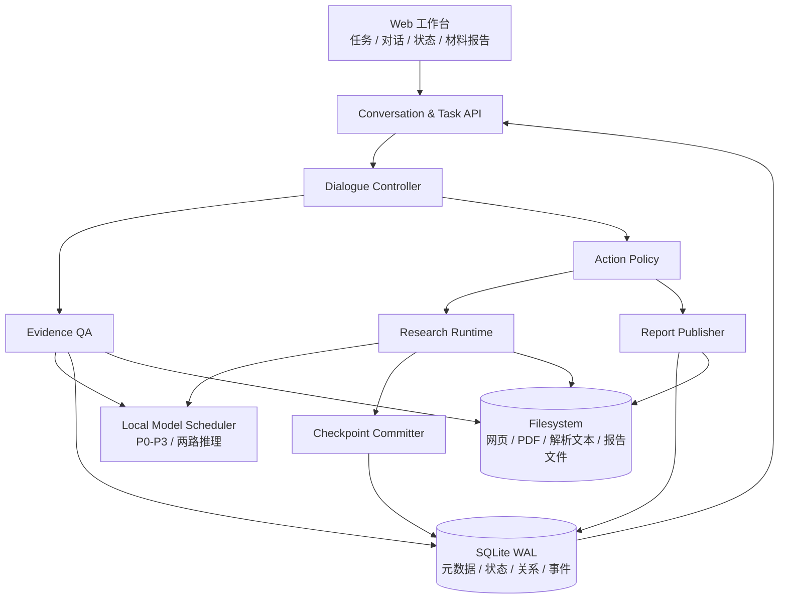
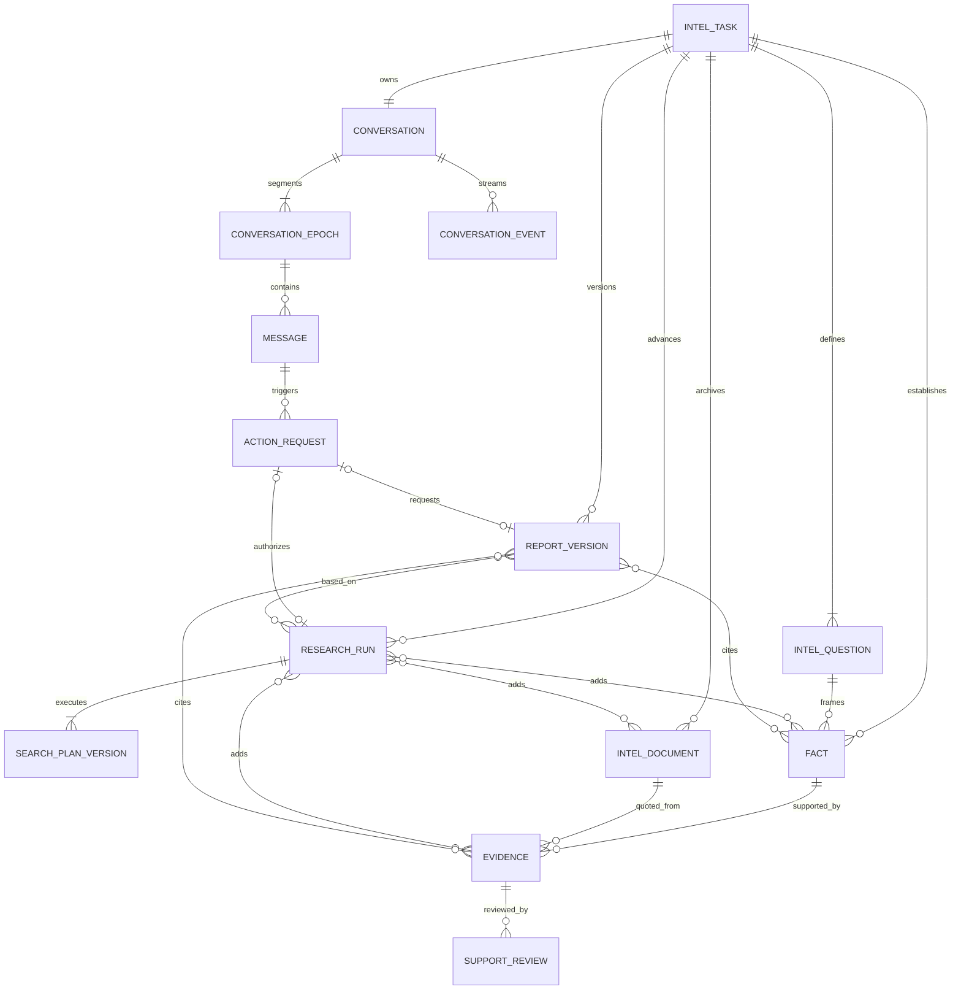
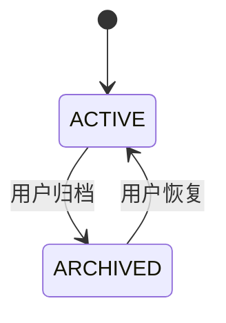
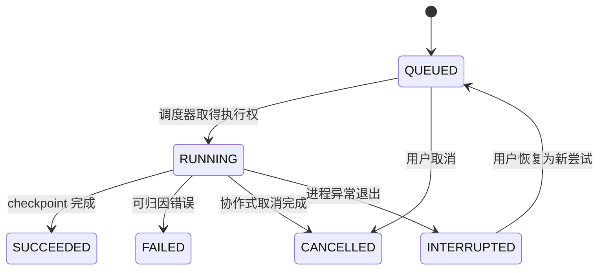
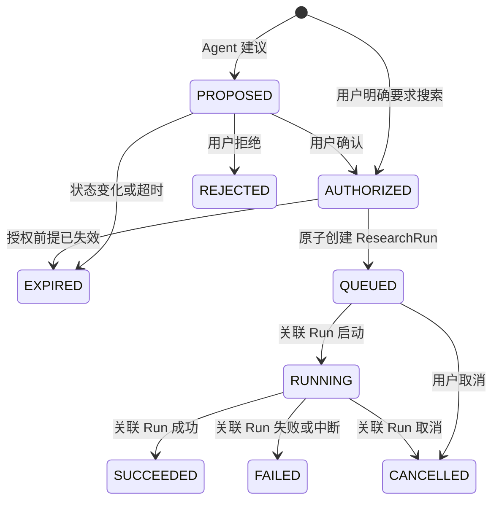
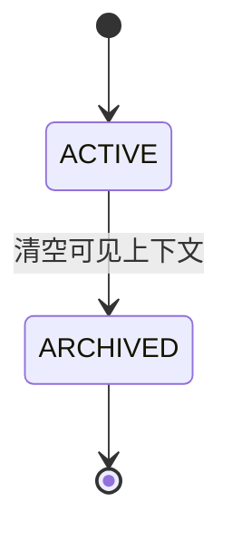
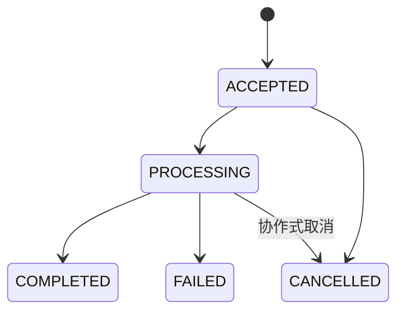
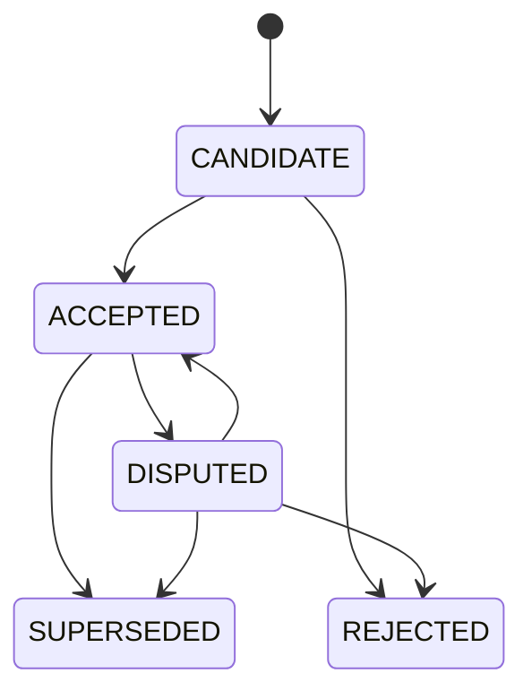
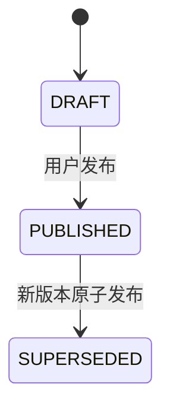
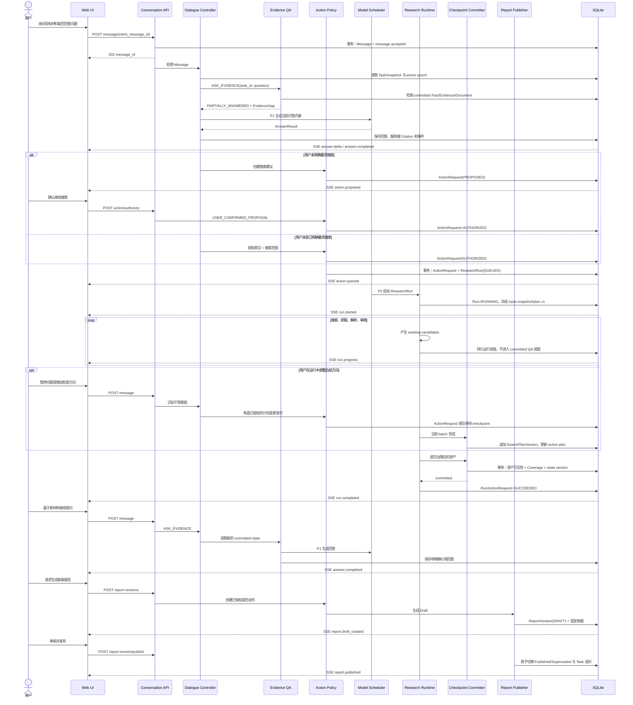

# 任务驱动多轮对话重构架构设计

| 项目 | 内容 |
| --- | --- |
| 状态 | 设计决策已确认，待书面评审 |
| 确认日期 | 2026-08-25 |
| 适用范围 | 本地单用户公开信息调研工作台 |
| 核心目标 | 将一次性研究运行改造成任务驱动、状态持久、可对话控制的调研系统 |

## 1. 目标与非目标

### 1.1 建设目标

用户始终在一个 `IntelTask` 内工作。初始研究运行期间及完成后，用户能够通过
网页多轮对话：

1. 查询任务状态、方法、已验证事实和已收集材料；
2. 点击引用定位到任务内材料的精确位置；
3. 明确授权补充研究，形成新的 `ResearchRun`；
4. 在安全 checkpoint 修改后续搜索方向；
5. 基于新证据生成报告草稿，并显式发布新版本；
6. 在服务重启或 SSE 断线后恢复任务、会话和事件进度。

核心原则是：

> `IntelTask` 是系统核心，`Conversation` 是交互入口，`Evidence` 是事实
> 依据，`ReportVersion` 是版本化产物，`ResearchRuntime` 才负责执行
> 情报搜集。

### 1.2 首版非目标

- 不建设跨任务知识库，也不从其他任务偷偷补充回答；
- 不支持登录页面、人工账号托管或绕过复杂验证码；
- 不建设多用户权限、租户隔离或远程协作；
- 不引入 WebSocket、Redis、Celery、向量数据库或第三路模型并发；
- 不允许聊天直接修改 Fact、Evidence、SearchPlan 或已发布报告；
- 不在一次模型请求生成期间进行强制抢占；
- 不把阅读推荐星级解释为可信度或证据质量。

## 2. 当前实现与重构原因

当前链路是：

```text
POST /api/runs
  → 内存 RunRegistry
  → run_agent_task
  → 原子 JSON 保存任务、材料、事实、证据和覆盖
  → GET /api/tasks/{task_id}
  → 报告/材料页面
```

可以继续复用的能力包括：

- [`IntelTask / IntelDocument / Fact / Evidence`](../../src/intel_agent/models.py)
  及其完整性校验；
- [`TaskView`](../../src/intel_agent/web/views.py) 聚合的任务、问题、事实、
  证据、冲突、材料和覆盖信息；
- [`document_read`](../../src/intel_agent/agent.py) 已有的行号、正文大小、
  哈希验证和不可信内容边界；
- [`context.py`](../../src/intel_agent/context.py) 已验证的有界上下文思想；
- [`RunRegistry`](../../src/intel_agent/web/runs.py) 和现有 SSE 协议的运行事件
  投影；
- 前端已有的 Markdown 安全渲染、报告视图和材料列表。

当前实现不能直接承载多轮对话，原因是：

- 运行和事件只存在于进程内，服务重启后丢失；
- `IntelTask.stage=done` 把一次运行完成误当成任务永久终止；
- 没有 Conversation、Message、ActionRequest、ResearchRun 和报告版本；
- JSON 文件无法为消息、后台运行、取消、checkpoint 和报告发布提供跨对象事务；
- 研究上下文处理器面向“下一工具动作”，不能直接作为任务问答上下文；
- 现有文档工具没有完整的 `task_id` 所有权门禁，不能原样暴露给 Dialogue
  Agent；
- 报告引用由后端确定性生成，而聊天模型自由生成引用会破坏证据纪律。

## 3. 总体架构



组件边界如下：

| 组件 | 唯一职责 | 不负责 |
| --- | --- | --- |
| Dialogue Controller | 识别意图，构造问答或 ActionRequest | 直接搜索、抓取或修改资产 |
| Evidence QA | 在当前 Task 已提交资产中检索并生成有引用回答 | 写入 Fact/Evidence 或跨任务查询 |
| Action Policy | 判断显式授权、确认、拒绝和过期 | 自行解释研究结果 |
| Research Runtime | 执行 ResearchRun 和 SearchPlanVersion | 管理聊天展示 |
| Checkpoint Committer | 原子提交运行产生的治理后资产 | 生成自然语言回答 |
| Report Publisher | 生成草稿并原子发布 ReportVersion | 覆写历史版本 |
| Model Scheduler | 在两路推理容量内按优先级调度 | 创建业务状态 |
| Task Projection | 重建 TaskSnapshot | 成为新的事实源 |

## 4. 领域模型

### 4.1 对象分类

不新增与现有模型同义的 `ResearchTask / Material / Finding`。正式术语见
根目录 [`CONTEXT.md`](../../CONTEXT.md)。

| 分类 | 对象 | 说明 |
| --- | --- | --- |
| 现有核心对象 | IntelTask、IntelQuestion、IntelDocument、Fact、Evidence、SupportReview | 保留名称，迁移元数据存储 |
| 新增核心对象 | Conversation、Message、ActionRequest、ResearchRun、ReportVersion | 具有身份和独立生命周期 |
| 持久辅助记录 | ConversationEpoch、SearchPlanVersion | 保存可审计历史，不作为独立业务入口 |
| 值对象 | DialogueIntent、AnswerResult、Citation、EvidenceGap | 随消息或响应保存 |
| 派生视图 | TaskSnapshot | 可从权威状态重新构造，可缓存但不可反向写回 |

### 4.2 ER 图



ResearchRun 与 Document、Fact、Evidence 分别使用明确关联表，避免多态
`asset_type/asset_id` 破坏 SQLite 外键约束。关联记录保存资产是否已经
checkpoint 提交。

### 4.3 关键字段

#### Conversation 与 Message

```text
Conversation
  id, task_id, active_epoch_id, created_at, updated_at

ConversationEpoch
  id, conversation_id, sequence, summary, started_at, archived_at

Message
  id, epoch_id, role, content, status, intent,
  authorization_quote, reply_to_id, created_at, completed_at, error
```

`Message.content` 创建后不可修改。重新回答产生新 assistant Message，不覆盖
旧消息。清空上下文会归档当前 epoch 并新建 epoch；审计记录继续保留。

#### ActionRequest

```text
ActionRequest
  id, task_id, trigger_message_id,
  action_type, immutable_payload,
  status, authorized_at, queued_at, started_at, completed_at,
  research_run_id, report_version_id, error, expires_at
```

业务内容不可变，生命周期字段可以推进。`immutable_payload` 至少包含目标
问题、范围、原因和建议查询方向。研究动作关联 `research_run_id`，报告动作关联
`report_version_id`，两者至多一个非空。

#### ResearchRun

```text
ResearchRun
  id, task_id, run_type,
  trigger_message_id, action_request_id,
  input_state_version, input_snapshot,
  initial_search_plan_version_id, active_search_plan_version_id,
  status, phase, outcome,
  started_at, completed_at, error
```

`input_snapshot` 保存运行开始时的最小解释性状态；当前 TaskSnapshot 不能用于
解释历史运行。一个 Run 至少有一个 SearchPlanVersion，checkpoint 干预追加新
版本并更新 active 指针。资产增量通过三张明确关联表查询，不在 Run 行内保存
可变数组。

IntelDocument、Fact、Evidence 记录 `created_by_run_id` 和 `committed_at`。
`committed_at` 为空的 working candidate 只能被对应 ResearchRun 和恢复逻辑
读取，不能进入 Dialogue Retrieval、Coverage 或 ReportVersion。

#### ReportVersion

```text
ReportVersion
  id, task_id, version, status,
  content_path, content_sha256,
  based_on_state_version,
  created_at, published_at
```

运行、Fact 和 Evidence 依据使用关联表固定。`IntelTask` 保存
`current_draft_report_version_id` 和 `current_published_report_version_id`。

### 4.4 领域不变量

1. 每个业务对象只属于一个 IntelTask；所有读取先校验 task ownership。
2. 每个 IntelTask 恰有一个 Conversation，同一时刻恰有一个 active epoch。
3. 每个 IntelTask 同时最多一个 active ResearchRun；首版工作区同时最多一个
   active ResearchRun，其余运行排队。
4. ActionRequest 的 action type、payload 和触发消息创建后不可修改。
5. SearchPlanVersion、Message、SupportReview 和 ReportVersion 永不覆盖。
6. Document、Fact、Evidence 不物理删除；认识变化通过状态与替代关系表达。
7. Evidence 的逐字引用、文档哈希和行号必须在读取时重新校验。
8. Evidence QA 默认只读取 checkpoint 后的 committed state。
9. 每个 Task 同时最多一个 Published ReportVersion；发布在单个事务内切换。
10. TaskSnapshot 可以丢弃并重建，不能作为事务输入覆盖权威记录。
11. 阅读优先级只影响材料页的阅读排序，不能参与证据审核或覆盖评分。

## 5. 状态机

### 5.1 IntelTask

多轮续研后，`done` 不能继续作为 IntelTask 的永久终态。Task 只保留稳定的
生命周期；工作状态由运行和报告投影得到。



派生的 `work_state`：

```text
RESEARCHING       存在 active ResearchRun
READY_FOR_REVIEW  没有 active Run，存在未发布 Draft
IDLE              没有 active Run，也没有待处理 Draft
```

`completion_status` 取最新 committed CoverageSnapshot 的
`sufficient/with_gaps`，不是不可逆生命周期。

### 5.2 ResearchRun



Run 的 `phase` 独立记录：

```text
PLANNING → COLLECTING → ASSESSING → CHECKPOINTING
```

`outcome` 仅在成功后记录 `SUFFICIENT` 或 `WITH_GAPS`。恢复不会改写历史
事件；同一 Run 可以重新排队，但每次状态迁移都写入事件表。

### 5.3 ActionRequest



旧建议在后续运行已经补齐同一缺口时进入 `EXPIRED`，防止用户点击旧按钮
触发重复研究。

### 5.4 Conversation、Epoch 与 Message

Conversation 随 Task 存续，不提供普通物理删除。Epoch 状态机为：



Message 状态机为：



取消回答不撤销已经由独立事务授权的 ActionRequest；需要单独取消 Action 或
ResearchRun。

### 5.5 Fact 与 Evidence

Fact 生命周期：



Evidence 是不可变引文，不使用 `SUPERSEDED` 表示文本变化。其治理状态为
`CANDIDATE / ACCEPTED / DISPUTED / REJECTED`；Fact 被替代后，关联 Evidence
仍作为历史依据保留。新的 SupportReview 追加保存，不能覆盖旧审核记录。

### 5.6 ReportVersion



生成失败不创建可发布版本。发布事务同时完成：旧 Published 版本转为
`SUPERSEDED`、新版本转为 `PUBLISHED`、Task 当前报告指针更新。

## 6. SQLite 与文件系统边界

### 6.1 权威数据

SQLite 数据库位于工作区 `data/intel/intel.db`，使用标准库 `sqlite3` 并启用：

```text
PRAGMA journal_mode = WAL
PRAGMA foreign_keys = ON
PRAGMA busy_timeout = 5000
```

数据库是以下内容的唯一真相源：

- Task、Question、Conversation、Epoch、Message；
- ActionRequest、ResearchRun、SearchPlanVersion、运行资产关系；
- Document 元数据、Fact、Evidence、审核、冲突、覆盖快照；
- ReportVersion 元数据和依据关系；
- 可恢复的 Conversation/Run 事件和 schema migration 版本。

文件系统继续保存：

- 原始 HTML、PDF、Office、图片、音频和视频；
- 解析后带行号或时间戳的文本；
- 浏览器渲染结果；
- 报告 Markdown/DOCX 等大文件。

数据库只保存安全相对路径、SHA-256、大小和内容类型。读取文件必须继续经过
工作区路径边界和哈希校验。

### 6.2 最小表集合

```text
schema_migrations
intel_tasks, intel_questions
conversations, conversation_epochs, messages
action_requests
research_runs, search_plan_versions
run_documents, run_facts, run_evidence
documents, facts, evidence, support_reviews, evidence_conflicts
coverage_snapshots
material_reviews, material_digests
report_versions, report_run_refs, report_fact_refs, report_evidence_refs
conversation_events
```

不为 TaskSnapshot 建表。必要缓存带 `state_version`，版本不一致时直接重建。

### 6.3 事务边界

| 事务 | 必须原子完成的变化 |
| --- | --- |
| 接收消息 | 写 Message、分配 conversation sequence、写 `message.accepted` |
| 授权动作 | 推进 ActionRequest、创建或关联 queued ResearchRun、写事件 |
| Checkpoint | 提交资产关系、推进 Fact/Evidence 状态、CoverageSnapshot、Task state version、事件 |
| 发布报告 | 旧版本失效、新版本发布、Task 指针和事件 |
| 新建 Epoch | 归档旧 Epoch、新建 active Epoch、更新 Conversation 指针 |

大型内容先写临时文件、计算哈希并原子 rename，再在数据库事务中登记。数据库
事务失败时，未被引用的临时资产由恢复流程清理；不能出现数据库指向半写文件。

## 7. 对话控制与证据问答

### 7.1 DialogueIntent

首版意图集合：

```text
ASK_EVIDENCE
ASK_TASK_STATUS
ASK_METHODOLOGY
CONTINUE_RESEARCH
SEARCH_GAP
SEARCH_SPECIFIC_TOPIC
GENERATE_REPORT
REGENERATE_REPORT
```

Dialogue Controller 使用结构化输出，不依赖“消息是否包含继续搜索”这样的字符
判断。对于自然语言显式授权，输出必须包含用户原文中的
`authorization_quote`；策略层无法确认授权时，只创建 `PROPOSED` 请求。
按钮确认直接形成 `USER_CONFIRMED_PROPOSAL` 授权。

前端快捷操作可以携带受限的 `intent_hint`，例如“查看当前进度”；服务端据此
直接构建 P0 状态投影。普通自由文本仍由 P1 Dialogue 模型识别，客户端不能用
`intent_hint` 绕过 Action Policy。

### 7.2 回答契约

```text
AnswerResult
  answer
  answerability = ANSWERED | PARTIALLY_ANSWERED | NOT_ANSWERABLE
  citations[]
  gaps[]
  suggested_actions[]
```

`Citation` 由后端绑定 `document_id / evidence_id / line_start / line_end`，前端
编号由返回顺序生成。模型不得手写来源编号或任意 URL。

回答展示遵循轻量协议：先直接回答并附引用；只有部分可答或不可答时，才展示
缺口和建议动作。未进入正式报告但已经 committed 的材料可以作为“材料线索”
引用，必须明确其尚未成为已验证证据。

### 7.3 任务内检索

检索顺序：

1. 与问题相关的 ACCEPTED Fact 和 Evidence；
2. DISPUTED 状态及冲突，用于回答争议问题；
3. 当前 Task 已提交的 IntelDocument 文本片段；
4. 如果仍不可答，生成 EvidenceGap 和可确认的 ActionRequest。

首版复用现有分词、文档行号和完整性校验，抽出 task-scoped retrieval service；
不引入向量数据库。只有基准测试证明词法检索无法达到材料问答召回门槛后，才
增加 embedding 检索。

### 7.4 对话上下文

每轮模型输入由确定性的 Context Builder 组成：

```text
System Instructions
+ TaskSnapshot
+ active ConversationEpoch summary
+ 最近 N 轮完整消息
+ 本轮检索到的 Evidence/Material passages
+ 必要的动作状态
```

即使配置 128K 或 256K 上下文，也不能装入全部网页、工具调用和历史消息。
Conversation summary 是压缩缓存，不是真相源；清空上下文后只读取新 epoch。

## 8. ResearchRun、checkpoint 与一致性

### 8.1 运行可见性

ResearchRun working state 与 Task committed state 分离：

```text
抓取/解析/候选 Fact/候选 Evidence
               │
               ▼
         CHECKPOINTING
               │ 单事务提交
               ▼
       Task committed state
               │
               ▼
          Evidence QA
```

运行期间，状态查询可以显示“发现 8 个候选材料、3 个正在解析”，但事实问答
不能把未提交 Search Result 当成已确认结论。

### 8.2 checkpoint 干预

用户干预排队到当前 query batch 或当前模型调用结束后的 checkpoint。允许：

- 新增、暂停、恢复关键问题；
- 修改后续查询优先级；
- 新增检索方向或停用尚未执行的查询；
- 对已提交 Fact/Evidence 发起争议、拒绝或替代流程。

禁止：

- 物理删除 Document、Fact、Evidence 或历史运行；
- 原地改写 SearchPlanVersion；
- 撤回已经完成的网络请求或模型生成；
- 通过聊天直接把候选证据改成 ACCEPTED。

变更生成新的 SearchPlanVersion，并关联触发 Message 与 ActionRequest。

## 9. 本地模型调度

本地部署为两路推理，总吞吐有限。首版调度优先级：

| 优先级 | 工作 | 策略 |
| --- | --- | --- |
| P0 | 结构化状态 API、已确认的状态快捷操作 | 纯投影，不调用模型 |
| P1 | 自由文本意图识别、用户 Evidence QA | 当前 generation 完成后优先取得空闲 slot |
| P2 | ResearchRun 主 Agent 与必要审核 | 使用剩余容量，不被中途抢占 |
| P3 | 摘要、材料导读等后台预计算 | 无 P1/P2 时运行 |

调度器容量固定为两路，不为聊天增加第三路。P1 到来时不杀死正在生成的 P2；
当前调用完成后，P1 先于下一次 P2 调用。首版工作区只运行一个 ResearchRun，
但可同时保留多个 queued Run。自然语言“现在查到哪里了”需要 P1 识别；只有
结构化状态接口和 UI 快捷操作属于真正不调用模型的 P0。

## 10. API 与 SSE 协议

### 10.1 HTTP 接口

```text
GET  /api/tasks/{task_id}/conversation
POST /api/tasks/{task_id}/conversation/messages
POST /api/messages/{message_id}/cancel

POST /api/action-requests/{action_request_id}/authorize
POST /api/action-requests/{action_request_id}/reject
POST /api/action-requests/{action_request_id}/cancel

GET  /api/tasks/{task_id}/runs
POST /api/runs/{run_id}/cancel

GET  /api/tasks/{task_id}/report-versions
POST /api/tasks/{task_id}/report-versions
POST /api/report-versions/{report_version_id}/publish

GET  /api/tasks/{task_id}/conversation/events
```

发送消息返回 HTTP 202：

```json
{
  "message_id": "msg-...",
  "status": "accepted"
}
```

客户端提供 `client_message_id` 作为幂等键；网络重试不能产生重复消息或重复
ActionRequest。

### 10.2 SSE 事件

```json
{
  "event_id": 32,
  "task_id": "task-...",
  "conversation_id": "conversation-...",
  "message_id": "msg-...",
  "action_request_id": null,
  "research_run_id": null,
  "type": "answer.delta",
  "created_at": "2026-08-25T08:00:00Z",
  "data": {}
}
```

稳定事件类型：

```text
message.accepted
message.cancelled
message.failed
intent.detected
retrieval.started
retrieval.completed
answer.started
answer.delta
answer.completed
action.proposed
action.authorized
action.queued
action.running
action.succeeded
action.failed
action.rejected
action.expired
action.cancelled
run.queued
run.started
run.progress
run.completed
run.failed
run.cancelled
run.interrupted
report.draft_created
report.published
report.superseded
error
```

`event_id` 在一个 Conversation 内单调递增并持久化。客户端使用
`Last-Event-ID` 恢复；无事件时保持 `: heartbeat`。服务重启不会丢失已提交
事件。

## 11. 完整用户操作时序



该图展示“材料不足后续研”的完整路径。材料足以回答时，流程在首次
`answer.completed` 结束；如果 `ActionRequest` 没有进入 AUTHORIZED，流程在
建议阶段结束，不允许创建 ResearchRun。重新提问不会自动复用过期授权。

## 12. Web 交互

桌面端目标布局：

```text
┌────────────┬────────────────────────┬────────────────────┐
│ 调研任务    │ 对话                    │ 当前任务            │
│            │                        │                    │
│ Task A     │ 用户问题与引用回答        │ 关键问题进度          │
│ Task B     │ 缺口与建议动作            │ 材料 / 证据 / 冲突    │
│ Task C     │ 运行进度与报告草稿提示      │ 报告版本              │
└────────────┴────────────────────────┴────────────────────┘
```

任务区仍按 `task_id` 切换。对话区是主要交互面；右侧任务区提供“概览、材料、
证据、报告”视图并可折叠。点击引用时展开材料侧栏并定位到行号，展示：

- 标题、来源机构、类型、发布时间、抓取时间和原始 URL；
- 原文引用及页码/段落/行号；
- 材料状态、Evidence 状态、关联问题和报告使用状态。

引用侧栏不显示阅读星级。材料页可以显示“阅读优先级 1–5”，tooltip 明确其
不代表可信度、事实真实性或证据质量。

运行中允许：

- 立即查看确定性状态；
- 排队进行 Evidence QA；
- 提交将在 checkpoint 应用的干预。

## 13. 报告生成与发布

初次研究和每次续研都只生成 Draft。发布前必须验证：

- 报告文件哈希正确；
- 引用的 Fact/Evidence 均属于当前 Task；
- Evidence 精确引文仍与文档一致；
- `based_on_state_version` 不晚于当前 committed state；
- 报告明确保留未回答问题、争议和证据缺口。

发布是用户显式操作。聊天中的“把第二段写得肯定一些”只能形成草稿预览或
ActionRequest，不能改变 Published Report，也不能改变 Evidence 状态。

## 14. 迁移策略

SQLite 在本次重构中一次性成为元数据真相源，不建立长期 JSON/SQLite 双写。

迁移流程：

1. 创建带 schema version 的空数据库；
2. 在单事务中导入现有 Task、Document、Fact、Evidence、Review、Coverage、
   MaterialDigest 和当前 Report binding；
3. 校验对象计数、外键、文件路径和 SHA-256；
4. 为每个 Task 创建 Conversation、首个 active epoch 和初始 ResearchRun
   历史记录；
5. 将当前报告导入为 Published ReportVersion；
6. 原子切换运行时到 SQLite；
7. 原 JSON 保留为只读迁移备份，不再读取或写入，验收后统一归档。

导入器必须幂等：同一工作区重复执行只验证已有迁移，不重复创建业务对象。
任何校验失败都回滚数据库事务，现有运行时继续使用旧数据，不产生半迁移状态。

## 15. 故障与恢复

| 故障 | 行为 |
| --- | --- |
| 浏览器断开 | 使用 Last-Event-ID 恢复 SSE，不重复消息 |
| Dialogue 模型失败 | Message=FAILED，保留检索结果，允许重新回答 |
| Research 进程退出 | Run=INTERRUPTED，未 checkpoint 资产不可用于 QA |
| 文件写入失败 | 数据库事务不登记文件，清理临时文件 |
| checkpoint 事务失败 | committed state 不变化，Run 保持可诊断失败状态 |
| 报告发布失败 | 旧 Published 版本和 Task 指针保持不变 |
| Action 建议失效 | ActionRequest=EXPIRED，旧按钮不可再次授权 |
| 用户取消回答 | 协作式停止 Message；独立 Action/Run 需单独取消 |

## 16. 安全边界

- Dialogue Retrieval 的每个 document/evidence ID 必须同时匹配 task_id；
- 原始材料仍视为不可信数据，进入模型前保留不可信内容包装；
- 继续研究复用 DNS pinning、SSRF、redirect、robots 和下载预算；
- Citation 由服务端记录绑定，模型不能生成可点击的任意本地路径；
- SQLite 参数全部使用绑定参数，不拼接用户输入；
- 大文件下载仍使用 attachment 和 `X-Content-Type-Options: nosniff`；
- 首版本地单用户不增加登录系统，但数据库和文件路径仍限制在工作区内。

## 17. 可观测性

业务轨迹必须能够直接回答：

```text
哪条 Message
→ 被识别为什么 DialogueIntent
→ 产生哪个 ActionRequest
→ 授权了哪个 ResearchRun
→ 使用哪个 SearchPlanVersion
→ 在哪个 checkpoint 提交哪些资产
→ 形成哪个 ReportVersion
```

模型调用日志只用于技术诊断，不能替代上述业务关系。所有状态迁移记录
actor、reason、previous_status、new_status、时间和关联 ID。

## 18. 验收标准

### 18.1 领域与数据一致性

- 数据库启用 WAL 和 foreign keys，迁移后无孤立外键；
- 一个 Task 不能同时启动两个 active ResearchRun；
- 一个 Task 不能存在两个 Published ReportVersion；
- TaskSnapshot 删除后能够从数据库完整重建；
- 服务异常退出后，已提交消息、事件和 checkpoint 不丢失；
- 不存在运行期 JSON/SQLite 双写。

### 18.2 问答与引用

- 普通问题不会产生网络请求或 ResearchRun；
- 回答只检索当前 task_id 的 committed 资产；
- 所有事实性回答引用均能定位到哈希验证后的文档精确行；
- 未审核材料明确标记为材料线索，不冒充正式证据；
- 材料不足时返回 `PARTIALLY_ANSWERED/NOT_ANSWERABLE` 和具体缺口；
- 清空上下文后模型不读取旧 epoch，审计仍可查询旧消息。

### 18.3 动作与运行

- 显式搜索指令直接形成 AUTHORIZED ActionRequest；
- 模糊缺口只形成 PROPOSED 请求，未经确认不联网；
- 已失效建议不能创建重复 Run；
- 干预只在 checkpoint 应用，并产生新 SearchPlanVersion；
- 运行中未提交候选不会进入 Evidence QA；
- P1 问答优先于下一次 P2 调用，但不打断已经开始的 generation。

### 18.4 报告与恢复

- 生成 Draft 不改变当前 Published Report；
- 发布事务失败时旧报告仍有效；
- 每个版本能还原其 run/fact/evidence 依据；
- SSE 断线重连不丢事件、不重复完成消息；
- 浏览器刷新和服务重启后可以继续查看同一 Conversation。

## 19. 实施边界

该设计可拆为五个按依赖顺序交付的部分：

1. SQLite schema、迁移器和 repository 边界；
2. 持久 ResearchRun、ActionRequest、事件与 checkpoint；
3. task-scoped Evidence QA、Conversation 和有界上下文；
4. 续研授权、调度器和运行中干预；
5. ReportVersion、发布事务和三栏 Web 工作台。

具体逐文件顺序、测试夹具和迁移回滚步骤由后续实施计划定义。本设计不授权
立即修改生产代码。
