# 任务驱动多轮对话重构架构设计

| 项目 | 内容 |
| --- | --- |
| 状态 | 架构基线已冻结，可进入实施设计 |
| 确认日期 | 2026-08-25 |
| 适用范围 | 本地单用户公开信息调研工作台 |
| 核心目标 | 将一次性研究运行改造成任务驱动、状态持久、可对话控制的调研系统 |

## 1. 目标与非目标

### 1.1 建设目标

用户始终在一个 `IntelTask` 内工作。初始研究运行期间及完成后，用户能够通过
网页多轮对话：

1. 查询任务状态、方法、已验证事实和已收集材料；
2. 点击引用定位到任务内材料的精确位置；
3. 明确授权补充研究，形成新的 `ResearchRun`；
4. 在安全 checkpoint 修改后续搜索方向；
5. 基于新证据生成报告草稿，并显式发布新版本；
6. 在服务重启或 SSE 断线后恢复任务、会话和事件进度。

核心原则是：

> `IntelTask` 是系统核心，`Conversation` 是交互入口，`Evidence` 是事实
> 依据，`ReportVersion` 是版本化产物，`ResearchRuntime` 才负责执行
> 情报搜集。

### 1.2 首版非目标

- 不建设跨任务知识库，也不从其他任务偷偷补充回答；
- 不支持登录页面、人工账号托管或绕过复杂验证码；
- 不建设多用户权限、租户隔离或远程协作；
- 不引入 WebSocket、Redis、Celery、向量数据库或第三路模型并发；
- 不允许聊天直接修改 Fact、Evidence、SearchPlan 或已发布报告；
- 不在一次模型请求生成期间进行强制抢占；
- 不把阅读推荐星级解释为可信度或证据质量。

## 2. 当前实现与重构原因

当前链路是：

```text
POST /api/runs
  → 内存 RunRegistry
  → run_agent_task
  → 原子 JSON 保存任务、材料、事实、证据和覆盖
  → GET /api/tasks/{task_id}
  → 报告/材料页面
```

可以继续复用的能力包括：

- [`IntelTask / IntelDocument / Fact / Evidence`](../../src/intel_agent/models.py)
  及其完整性校验；
- [`TaskView`](../../src/intel_agent/web/views.py) 聚合的任务、问题、事实、
  证据、冲突、材料和覆盖信息；
- [`document_read`](../../src/intel_agent/agent.py) 已有的行号、正文大小、
  哈希验证和不可信内容边界；
- [`context.py`](../../src/intel_agent/context.py) 已验证的有界上下文思想；
- [`RunRegistry`](../../src/intel_agent/web/runs.py) 和现有 SSE 协议的运行事件
  投影；
- 前端已有的 Markdown 安全渲染、报告视图和材料列表。

当前实现不能直接承载多轮对话，原因是：

- 运行和事件只存在于进程内，服务重启后丢失；
- `IntelTask.stage=done` 把一次运行完成误当成任务永久终止；
- 没有 Conversation、Message、ActionRequest、ResearchRun 和报告版本；
- JSON 文件无法为消息、后台运行、取消、checkpoint 和报告发布提供跨对象事务；
- 研究上下文处理器面向“下一工具动作”，不能直接作为任务问答上下文；
- 现有文档工具没有完整的 `task_id` 所有权门禁，不能原样暴露给 Dialogue
  Agent；
- 报告引用由后端确定性生成，而聊天模型自由生成引用会破坏证据纪律。

## 3. 总体架构

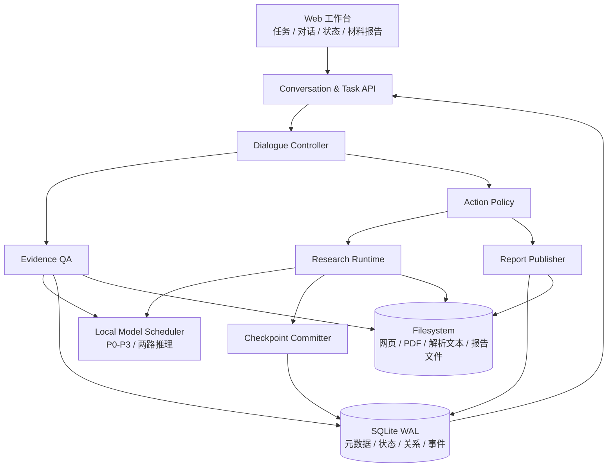

组件边界如下：

| 组件 | 唯一职责 | 不负责 |
| --- | --- | --- |
| Dialogue Controller | 识别意图，构造问答或 ActionRequest | 直接搜索、抓取或修改资产 |
| Evidence QA | 在当前 Task 已提交资产中检索并生成有引用回答 | 写入 Fact/Evidence 或跨任务查询 |
| Action Policy | 判断显式授权、确认、拒绝和过期 | 自行解释研究结果 |
| Research Runtime | 执行 ResearchRun 和 SearchPlanVersion | 管理聊天展示 |
| Checkpoint Committer | 原子提交运行产生的治理后资产 | 生成自然语言回答 |
| Report Publisher | 生成草稿并原子发布 ReportVersion | 覆写历史版本 |
| Model Scheduler | 在两路推理容量内按优先级调度 | 创建业务状态 |
| Task Projection | 重建 TaskSnapshot | 成为新的事实源 |

## 4. 领域模型

### 4.1 对象分类

不新增与现有模型同义的 `ResearchTask / Material / Finding`。正式术语见
根目录 [`CONTEXT.md`](../../CONTEXT.md)。

本文下文的 checkpoint 均指持久化的 `ResearchCheckpoint`，不是临时自动保存点。

| 分类 | 对象 | 说明 |
| --- | --- | --- |
| 现有核心对象 | IntelTask、IntelQuestion、IntelDocument、Fact、Evidence、SupportReview | 保留名称，迁移元数据存储 |
| 新增核心对象 | Conversation、Message、ActionRequest、ResearchRun、ReportVersion | 具有身份和独立生命周期 |
| 持久辅助记录 | ConversationEpoch、SearchPlanVersion、ResearchCheckpoint、MessageCitation、DomainStateTransition | 保存事务边界、引用和可审计历史，不作为独立业务入口 |
| 值对象 | DialogueIntent、AnswerResult、EvidenceGap、SourceLocator | 随消息或响应保存 |
| 派生视图 | TaskSnapshot | 可从权威状态重新构造，可缓存但不可反向写回 |

### 4.2 ER 图

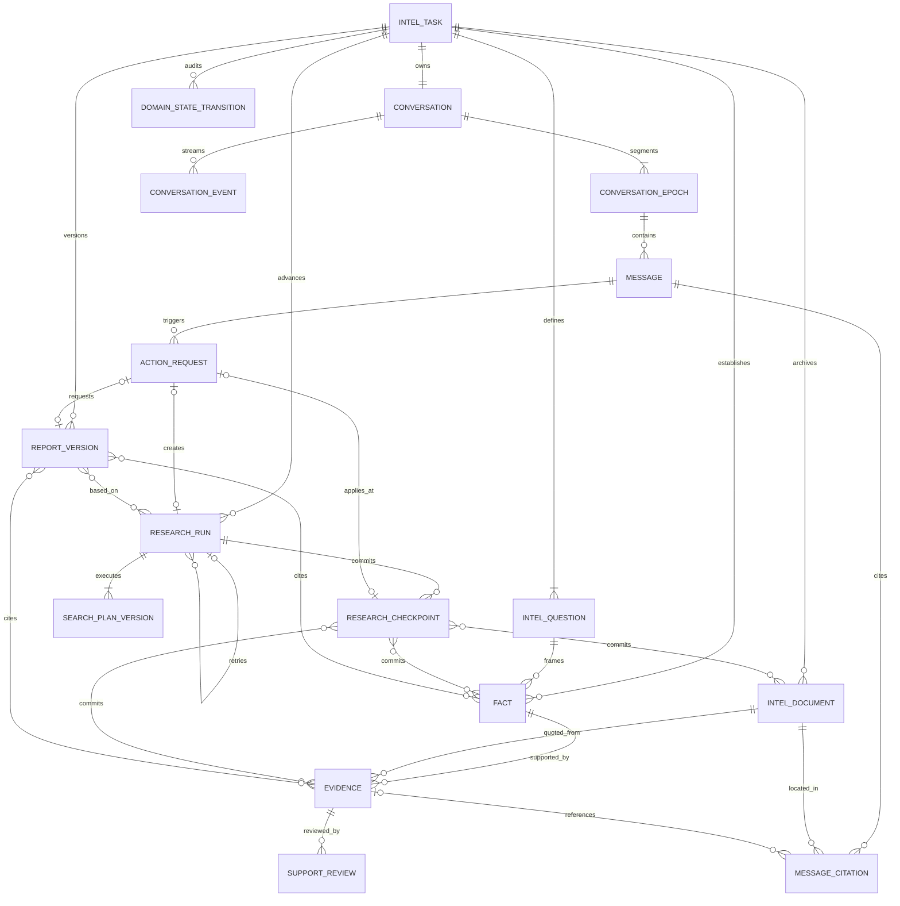

ResearchCheckpoint 与 Document、Fact、Evidence 分别使用明确关联表，避免
多态 `asset_type/asset_id` 破坏 SQLite 外键约束。Run 的资产增量由其
checkpoint 关联推导，不再重复维护 `run_*` 资产关联表。

### 4.3 关键字段

#### IntelTask 扩展字段

```text
IntelTask
  current_committed_state_version,
  current_draft_report_version_id,
  current_published_report_version_id
```

`current_committed_state_version` 是 Evidence QA、TaskSnapshot、ResearchRun 输入和
ReportVersion 依据共同使用的研究状态版本。仅改变已提交 Document、Fact、
Evidence、Coverage 或 Conflict 的 checkpoint 才递增该值。
新 Task 从 0 开始。
TaskSnapshot 暴露同名版本；其中 committed research 子投影可按该版本缓存，
active Run/Action 等运行态每次读取权威表，不复用该缓存。

#### Conversation 与 Message

```text
Conversation
  id, task_id, active_epoch_id, created_at, updated_at

ConversationEpoch
  id, conversation_id, sequence,
  summary, summary_through_sequence, summary_updated_at,
  started_at, archived_at

Message
  id, conversation_id, epoch_id,
  sequence, client_message_id nullable,
  role, content, status, intent,
  reply_to_id, created_at, completed_at, error
```

`Message.content` 创建后不可修改。重新回答产生新 assistant Message，不覆盖
旧消息。清空上下文会归档当前 epoch 并新建 epoch；审计记录继续保留。
`client_message_id` 只用于 user Message；assistant Message 为空。
`summary_through_sequence` 明确摘要已经覆盖到哪条 Message，Context Builder 只把
其后的消息作为 recent messages，避免重复注入。

#### ActionRequest

```text
ActionRequest
  id, task_id, trigger_message_id,
  action_type, immutable_payload,
  authorization_mode nullable,
  authorization_message_id nullable,
  authorization_quote nullable,
  precondition_committed_state_version,
  precondition_search_plan_version_id nullable,
  status, authorized_at, queued_at, executing_at, completed_at,
  created_research_run_id,
  target_research_run_id, applied_search_plan_version_id,
  applied_checkpoint_id, created_report_version_id,
  error, expires_at
```

业务内容不可变，生命周期字段可以推进。`immutable_payload` 至少包含目标
问题、范围、原因和建议查询方向。动作结果按 `action_type` 使用明确的可空外键：

- 研究动作关联 `created_research_run_id`；
- 运行中计划变更关联 `target_research_run_id`、
  `applied_search_plan_version_id` 和 `applied_checkpoint_id`；
- 报告动作关联 `created_report_version_id`。

数据库 `CHECK` 约束保证每类动作只填写允许的前置条件和结果字段；
MODIFY_SEARCH_PLAN 必须提供目标 Run 和前置计划版本。ActionRequest 表达“用户
授权了什么动作”，不是 ResearchRun 的影子状态机。

`authorization_mode` 首版只允许 `EXPLICIT_NATURAL_LANGUAGE` 和
`USER_CONFIRMED_PROPOSAL`。前者必须保存授权 Message 和逐字引用；后者保存按钮
确认产生的 user Message，`authorization_quote` 必须为空。PROPOSED 阶段三个
授权字段均为空。初始研究可以不由 ActionRequest 创建，因此不增加可能绕过用户
授权的 `SYSTEM_INTERNAL` 模式。
授权字段在 PROPOSED → AUTHORIZED 时一次写入，之后不可修改。

一条 Message 可以产生多个 ActionRequest；每个 ActionRequest 分别固定自己的
授权方式、授权 Message、授权范围和授权原文，不能共享 Message 级授权字段。
Message 的 `intent` 只保存结构化识别结果，可以包含多个请求动作，不承担授权
证明。

| action_type | 执行结果关联 |
| --- | --- |
| CONTINUE_RESEARCH / SEARCH_GAP / SEARCH_SPECIFIC_TOPIC | `created_research_run_id` |
| MODIFY_SEARCH_PLAN | `target_research_run_id`、`precondition_search_plan_version_id`、`applied_search_plan_version_id`、`applied_checkpoint_id` |
| GENERATE_REPORT / REGENERATE_REPORT | `created_report_version_id` |

#### ResearchRun

```text
ResearchRun
  id, task_id, run_type,
  provenance,
  trigger_message_id, action_request_id,
  retry_of_run_id,
  input_committed_state_version, input_snapshot,
  initial_search_plan_version_id, active_search_plan_version_id,
  status, phase, outcome,
  started_at, completed_at, error
```

`input_snapshot` 保存运行开始时的最小解释性状态；当前 TaskSnapshot 不能用于
解释历史运行。一个 Run 至少有一个 SearchPlanVersion，checkpoint 干预追加新
版本并更新 active 指针。每个 ResearchRun 只表示一次实际执行尝试；中断或失败
后的重试创建新 Run，并用 `retry_of_run_id` 指向上一尝试。

#### ResearchCheckpoint

```text
ResearchCheckpoint
  id, research_run_id, sequence,
  search_plan_version_id,
  input_committed_state_version, output_committed_state_version,
  status, started_at, committed_at,
  trigger_action_request_id nullable, reason
```

Checkpoint 是持久辅助记录，也是 working state 进入 committed state 的唯一事务
边界。`checkpoint_documents / checkpoint_facts / checkpoint_evidence` 固定每次
提交的资产。`(research_run_id, sequence)` 唯一；成功提交后记录不可修改。
只应用 SearchPlanVersion 而不改变已提交研究资产时，输入和输出
`committed_state_version` 相同。

IntelDocument、Fact、Evidence 记录 `created_by_run_id`、
`committed_by_checkpoint_id` 和 `committed_at`。
`committed_at` 为空的 working candidate 只能被对应 ResearchRun 和恢复逻辑
读取，不能进入 Dialogue Retrieval、Coverage 或 ReportVersion。

#### ReportVersion

```text
ReportVersion
  id, task_id, version, status,
  content_path, content_sha256,
  based_on_committed_state_version,
  publication_origin,
  created_at, published_at, abandoned_at
```

运行、Fact 和 Evidence 依据使用关联表固定。`IntelTask` 保存
`current_draft_report_version_id` 和 `current_published_report_version_id`。

#### MessageCitation 与 SourceLocator

```text
MessageCitation
  id, task_id, message_id,
  document_id, evidence_id nullable,
  citation_kind = VERIFIED_EVIDENCE | MATERIAL_CLUE,
  locator_type, locator_json,
  parsed_content_sha256, quote_sha256, quote_text, sequence
```

MessageCitation 是服务端创建的持久审计关系。`SourceLocator` 按材料类型表达
`TEXT_LINES / PDF_PAGE / PARAGRAPH / BBOX / AUDIO_TIME / VIDEO_TIME`；行号只是
其中一种定位方式。外键与 task ownership 约束保证引用不能跨任务。

#### 状态历史与报告快照

Fact 的 `statement / normalized_claim` 创建后不可修改；纠错时创建新 Fact，并用
替代关系指向旧 Fact。Evidence 的 `quote / document_id / locator /
source_content_hash` 创建后不可修改，只有治理状态可以迁移。每次治理状态变化
追加 `DomainStateTransition`：

```text
DomainStateTransition
  id, entity_type, task_id,
  fact_id nullable, evidence_id nullable,
  previous_status, new_status,
  actor_type, actor_id, reason,
  committed_state_version, created_at
```

`entity_type` 限定为 `FACT | EVIDENCE`；数据库 `CHECK` 约束要求对应且仅一个
外键非空。这样保留统一审计查询，同时不使用无法建立外键的多态 `entity_id`。

`report_fact_refs` 保存 `fact_status_at_generation / statement_sha256`；
`report_evidence_refs` 保存 `evidence_status_at_generation / quote_sha256`。因此旧报告
既能重放生成时状态，也能提示依据的当前状态已经变化。

### 4.4 领域不变量

1. 每个业务对象只属于一个 IntelTask；所有读取先校验 task ownership。
2. 每个 IntelTask 恰有一个 Conversation，同一时刻恰有一个 active epoch。
3. active ResearchRun 明确定义为 `status=RUNNING`。每个 IntelTask 和首版工作区
   同时最多一个 RUNNING ResearchRun；QUEUED Run 可以有多个。
4. ActionRequest 的 action type、payload、触发消息和前置版本创建后不可修改；
   授权字段第一次写入后不可修改。
5. SearchPlanVersion、Message、SupportReview、ResearchCheckpoint 和
   ReportVersion 永不覆盖。
6. Document、Fact、Evidence 不物理删除；Fact/Evidence 内容不可原地修改，
   认识变化通过状态历史与替代关系表达。
7. Evidence 和 MessageCitation 的逐字引用、来源定位和内容哈希必须在读取时
   重新校验。
8. Evidence QA 默认只读取 checkpoint 后的 committed state。
9. 每个 Task 同时最多一个 Published ReportVersion；发布在单个事务内切换。
10. TaskSnapshot 可以丢弃并重建，不能作为事务输入覆盖权威记录。
11. 阅读优先级只影响材料页的阅读排序，不能参与证据审核或覆盖评分。
12. Message 的 `(conversation_id, sequence)` 和非空
    `(conversation_id, client_message_id)` 分别唯一。
13. `committed_state_version` 只在 checkpoint 改变已提交研究状态时递增；消息、
    SSE 和报告发布不改变它。

## 5. 状态机

### 5.1 IntelTask

多轮续研后，`done` 不能继续作为 IntelTask 的永久终态。Task 只保留稳定的
生命周期；工作状态由运行和报告投影得到。

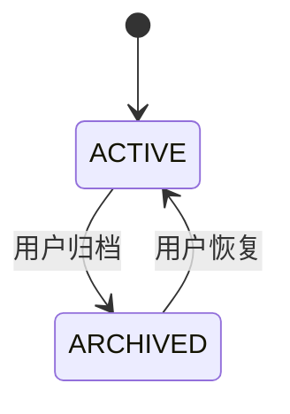

派生的 `work_state`：

```text
RESEARCHING       存在 active ResearchRun
QUEUED_FOR_RESEARCH  不存在 RUNNING Run，但存在 QUEUED Run
READY_FOR_REVIEW  没有 active Run，存在未发布 Draft
IDLE              没有 active Run，也没有待处理 Draft
```

投影按表中顺序匹配，避免存在 QUEUED Run 时误显示为 READY 或 IDLE。

`completion_status` 取最新 committed CoverageSnapshot 的
`sufficient/with_gaps`，不是不可逆生命周期。

### 5.2 ResearchRun

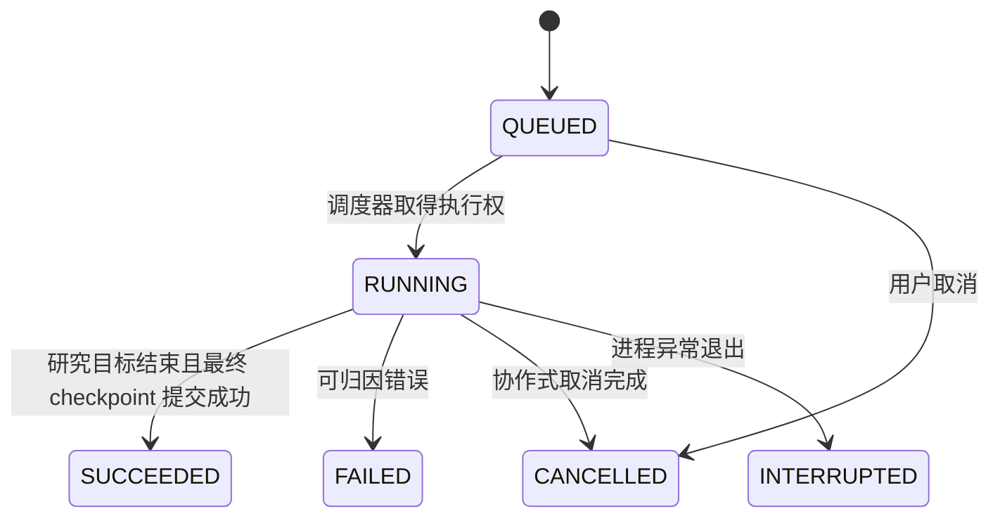

Run 的 `phase` 独立记录：

```text
PLANNING → COLLECTING → ASSESSING → CHECKPOINTING
```

`outcome` 仅在成功后记录 `SUFFICIENT` 或 `WITH_GAPS`。`SUCCEEDED / FAILED /
CANCELLED / INTERRUPTED` 均为终态，不允许同一 Run 重新排队。重试创建新的
ResearchRun，并用 `retry_of_run_id` 保留执行链。

### 5.3 ActionRequest

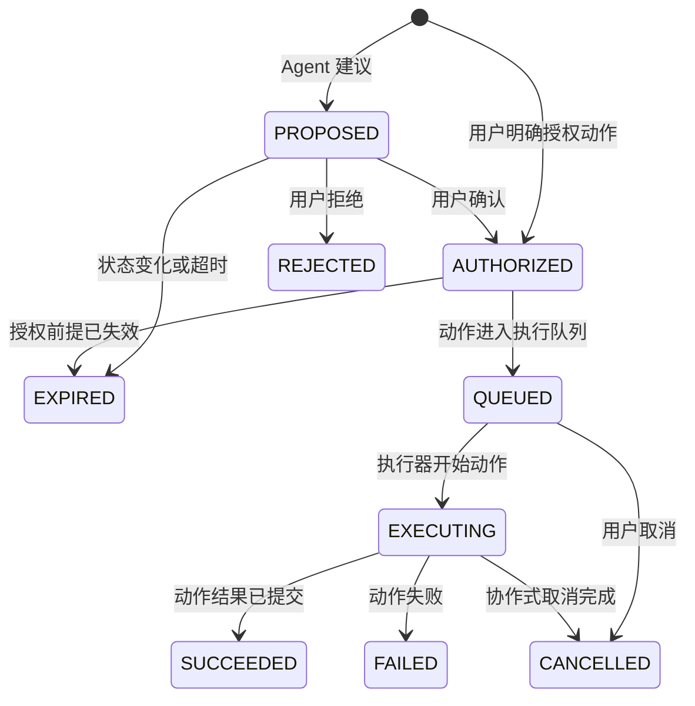

该状态机与具体执行对象无关。研究动作创建 ResearchRun；计划变更在目标 Run 的
ResearchCheckpoint 应用；报告动作创建 ReportVersion。旧建议的
`precondition_committed_state_version` 与当前版本不一致时必须重新校验；缺口已
消失或范围不再成立则进入 `EXPIRED`，不能创建重复工作。

`MODIFY_SEARCH_PLAN` 还必须比较目标 Run 当前
`active_search_plan_version_id` 与 `precondition_search_plan_version_id`。版本一致
时直接应用；不一致时只允许对互不冲突的字段做确定性 rebase 并生成下一版本，
存在冲突则标记 `EXPIRED`，由用户重新确认。

### 5.4 Conversation、Epoch 与 Message

Conversation 随 Task 存续，不提供普通物理删除。Epoch 状态机为：

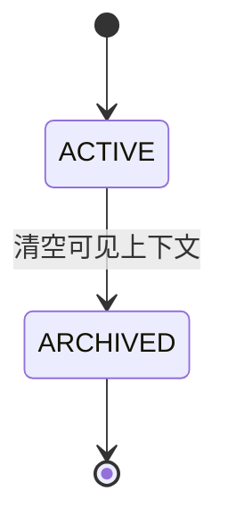

Message 状态机为：

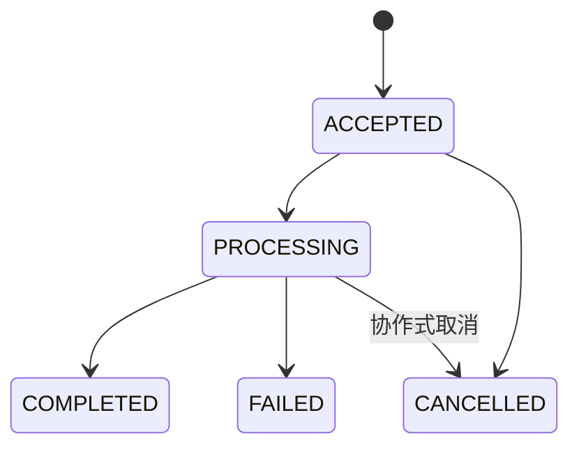

该处理状态机只用于 user Message。assistant Message 在完整内容生成后一次性插入，
初始状态即 `COMPLETED`，并用 `reply_to_id` 关联 user Message。流式 delta 使用
user Message ID 关联当前请求，不提前创建半成品 assistant Message。

取消回答不撤销已经由独立事务授权的 ActionRequest；需要单独取消 Action 或
ResearchRun。

### 5.5 Fact 与 Evidence

Fact 生命周期：

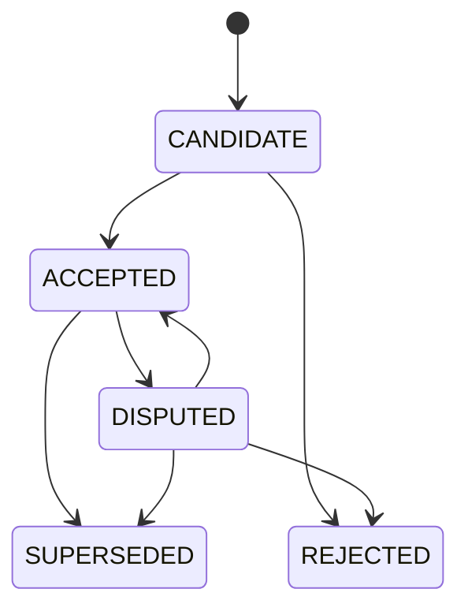

Evidence 是不可变引文，不使用 `SUPERSEDED` 表示文本变化。其治理状态为
`CANDIDATE / ACCEPTED / DISPUTED / REJECTED`；Fact 被替代后，关联 Evidence
仍作为历史依据保留。Fact/Evidence 的治理迁移都追加 DomainStateTransition；
新的 SupportReview 追加保存，不能覆盖旧审核记录。

### 5.6 ReportVersion

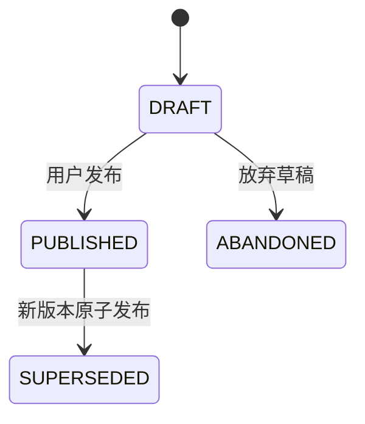

生成失败不创建可发布版本。创建新 Draft 时，事务将旧的 current Draft 标为
`ABANDONED` 并更新指针。发布事务同时完成：旧 Published 版本转为
`SUPERSEDED`、新版本转为 `PUBLISHED`、清空 current Draft 指针并更新 Task
当前 Published 指针。

默认只允许 `based_on_committed_state_version ==
task.current_committed_state_version` 的 Draft 发布。发布旧状态草稿必须由用户在
看到版本差异后显式确认 `publish_stale=true`，并重新校验引用状态和内容哈希；
不能静默发布过期草稿。

### 5.7 ResearchCheckpoint

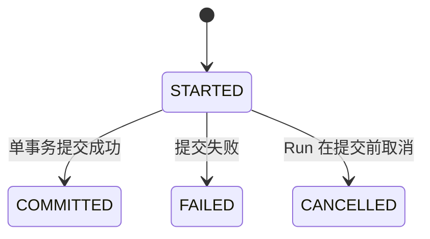

只有 `COMMITTED` checkpoint 可以推进 `committed_state_version` 并向 Task 读者
暴露资产。失败或取消记录保留诊断信息，但不产生部分提交。

## 6. SQLite 与文件系统边界

### 6.1 权威数据

SQLite 数据库位于工作区 `data/intel/intel.db`，使用标准库 `sqlite3` 并启用：

```text
PRAGMA journal_mode = WAL
PRAGMA foreign_keys = ON
PRAGMA busy_timeout = 5000
```

数据库是以下内容的唯一真相源：

- Task、Question、Conversation、Epoch、Message；
- ActionRequest、ResearchRun、SearchPlanVersion、ResearchCheckpoint 及其资产关系；
- Document 元数据、Fact、Evidence、审核、冲突、覆盖快照；
- MessageCitation、DomainStateTransition；
- ReportVersion 元数据、依据关系和生成时状态快照；
- 可恢复的 Conversation/Run 事件和 schema migration 版本。

文件系统继续保存：

- 原始 HTML、PDF、Office、图片、音频和视频；
- 解析后带行号或时间戳的文本；
- 浏览器渲染结果；
- 报告 Markdown/DOCX 等大文件。

数据库只保存安全相对路径、SHA-256、大小和内容类型。读取文件必须继续经过
工作区路径边界和哈希校验。

### 6.2 最小表集合

```text
schema_migrations
intel_tasks, intel_questions
conversations, conversation_epochs, messages
action_requests
research_runs, search_plan_versions
research_checkpoints
checkpoint_documents, checkpoint_facts, checkpoint_evidence
documents, facts, evidence, support_reviews, evidence_conflicts
domain_state_transitions
coverage_snapshots
material_reviews, material_digests
report_versions, report_run_refs, report_fact_refs, report_evidence_refs
message_citations, conversation_events
```

不为 TaskSnapshot 建表。只有 committed research 子投影按
`committed_state_version` 缓存；运行态始终从权威表读取。

下列不变量必须由 SQLite 唯一约束或 partial unique index 落实，而不是只由应用
代码检查：

```text
conversations(task_id)                                      UNIQUE
messages(conversation_id, sequence)                         UNIQUE
messages(conversation_id, client_message_id)                UNIQUE WHERE client_message_id IS NOT NULL
conversation_epochs(conversation_id)                        UNIQUE WHERE archived_at IS NULL
research_runs(task_id)                                      UNIQUE WHERE status = 'RUNNING'
report_versions(task_id)                                    UNIQUE WHERE status = 'DRAFT'
report_versions(task_id)                                    UNIQUE WHERE status = 'PUBLISHED'
```

### 6.3 事务边界

| 事务 | 必须原子完成的变化 |
| --- | --- |
| 接收消息 | 写 Message、分配 conversation sequence、写 `message.accepted` |
| 按钮授权动作 | 写确认 user Message、校验授权前提、推进 ActionRequest，并按类型排队对应执行器 |
| Checkpoint commit | 将 STARTED ResearchCheckpoint、资产关系、治理状态、DomainStateTransition、CoverageSnapshot、committed state version 和持久事件一起提交 |
| 发布报告 | 旧版本失效、新版本发布、Task 指针和事件 |
| 新建 Epoch | 归档旧 Epoch、新建 active Epoch、更新 Conversation 指针 |

大型内容先写临时文件、计算哈希并原子 rename，再在数据库事务中登记。数据库
事务失败时，未被引用的临时资产由恢复流程清理；不能出现数据库指向半写文件。

## 7. 对话控制与证据问答

### 7.1 DialogueIntent

首版意图集合：

```text
ASK_EVIDENCE
ASK_TASK_STATUS
ASK_METHODOLOGY
CONTINUE_RESEARCH
SEARCH_GAP
SEARCH_SPECIFIC_TOPIC
MODIFY_SEARCH_PLAN
GENERATE_REPORT
REGENERATE_REPORT
```

Dialogue Controller 使用结构化输出，不依赖“消息是否包含继续搜索”这样的字符
判断。对于自然语言显式授权，输出必须包含用户原文中的
授权片段；Action Policy 将它保存到对应 ActionRequest 的
`authorization_quote`。策略层无法确认授权时，只创建 `PROPOSED` 请求。
按钮确认直接形成 `USER_CONFIRMED_PROPOSAL` 授权。

Action Policy 必须执行以下硬约束，Dialogue 模型的分类结果本身不构成授权：

- `authorization_message_id` 必须指向当前 Task 的 user Message；
- `EXPLICIT_NATURAL_LANGUAGE` 的 `authorization_quote` 必须是该授权 Message 的
  逐字子串；`USER_CONFIRMED_PROPOSAL` 必须由确认接口记录 user Message，且引用
  为空；
- 自然语言动作范围不得大于引用文字明确要求的范围；按钮授权不得超过原
  PROPOSED ActionRequest 的 immutable payload；
- 否定、假设、疑问、转述或已撤回表达默认不构成自动授权；
- ActionRequest 记录 `precondition_committed_state_version`，授权时版本变化则先
  重新校验缺口与范围，前提消失时标记为 `EXPIRED`。

前端快捷操作可以携带受限的 `intent_hint`，例如“查看当前进度”；服务端据此
直接构建 P0 状态投影。普通自由文本仍由 P1 Dialogue 模型识别，客户端不能用
`intent_hint` 绕过 Action Policy。

### 7.2 回答契约

```text
AnswerResult
  answer
  answerability = ANSWERED | PARTIALLY_ANSWERED | NOT_ANSWERABLE
  citation_ids[]
  gaps[]
  suggested_actions[]
```

`citation_ids` 引用服务端持久化的 MessageCitation。后端校验 task ownership、
内容哈希和 SourceLocator 后绑定 Document/Evidence，前端编号由 `sequence`
生成。模型不得手写来源编号或任意 URL。

回答展示遵循轻量协议：先直接回答并附引用；只有部分可答或不可答时，才展示
缺口和建议动作。未进入正式报告但已经 committed 的材料可以作为“材料线索”
引用，必须明确其尚未成为已验证证据。

### 7.3 任务内检索

检索顺序：

1. 与问题相关的 ACCEPTED Fact 和 Evidence；
2. DISPUTED 状态及冲突，用于回答争议问题；
3. 当前 Task 已提交的 IntelDocument 文本片段；
4. 如果仍不可答，生成 EvidenceGap 和可确认的 ActionRequest。

首版复用现有分词、文档行号和完整性校验，抽出 task-scoped retrieval service；
不引入向量数据库。只有基准测试证明词法检索无法达到材料问答召回门槛后，才
增加 embedding 检索。

### 7.4 对话上下文

每轮模型输入由确定性的 Context Builder 组成：

```text
System Instructions
+ TaskSnapshot
+ active ConversationEpoch summary
+ 最近 N 轮完整消息
+ 本轮检索到的 Evidence/Material passages
+ 必要的动作状态
```

即使配置 128K 或 256K 上下文，也不能装入全部网页、工具调用和历史消息。
Conversation summary 是压缩缓存，不是真相源；清空上下文后只读取新 epoch。

## 8. ResearchRun、checkpoint 与一致性

### 8.1 运行可见性

ResearchRun working state 与 Task committed state 分离：

```text
抓取/解析/候选 Fact/候选 Evidence
               │
               ▼
         CHECKPOINTING
               │ 单事务提交
               ▼
       Task committed state
               │
               ▼
          Evidence QA
```

运行期间，状态查询可以显示“发现 8 个候选材料、3 个正在解析”，但事实问答
不能把未提交 Search Result 当成已确认结论。

每次提交先用短事务创建 `STARTED` ResearchCheckpoint，再在单个 commit 事务内
固定输入/输出 `committed_state_version`、计划版本、触发动作和新增资产，并将其
转为 `COMMITTED`。commit 失败后用独立短事务标记 `FAILED`。只有 COMMITTED
记录的输出版本和资产对 Task 读者可见；Run 的总资产增量由其 checkpoint 集合
推导。

### 8.2 checkpoint 干预

用户干预排队到当前 query batch 或当前模型调用结束后的 checkpoint。允许：

- 新增、暂停、恢复关键问题；
- 修改后续查询优先级；
- 新增检索方向或停用尚未执行的查询；
- 对已提交 Fact/Evidence 发起争议、拒绝或替代流程。

禁止：

- 物理删除 Document、Fact、Evidence 或历史运行；
- 原地改写 SearchPlanVersion；
- 撤回已经完成的网络请求或模型生成；
- 通过聊天直接把候选证据改成 ACCEPTED。

变更生成新的 SearchPlanVersion，并关联触发 Message、ActionRequest 和实际应用
该版本的 ResearchCheckpoint。

## 9. 本地模型调度

本地部署为两路推理，总吞吐有限。首版调度优先级：

| 优先级 | 工作 | 策略 |
| --- | --- | --- |
| P0 | 结构化状态 API、已确认的状态快捷操作 | 纯投影，不调用模型 |
| P1 | 自由文本意图识别、用户 Evidence QA | 当前 generation 完成后优先取得空闲 slot |
| P2 | ResearchRun 主 Agent 与必要审核 | 使用剩余容量，不被中途抢占 |
| P3 | 摘要、材料导读等后台预计算 | 无 P1/P2 时运行 |

调度器容量固定为两路，不为聊天增加第三路。P1 到来时不杀死正在生成的 P2；
当前调用完成后，P1 先于下一次 P2 调用。首版工作区只运行一个 ResearchRun，
但可同时保留多个 queued Run。自然语言“现在查到哪里了”需要 P1 识别；只有
结构化状态接口和 UI 快捷操作属于真正不调用模型的 P0。

为避免持续聊天饿死研究运行，首版固定 `max_consecutive_p1 = 3`：连续完成三个
P1 后，如果已有 P2 等待，下一个空闲 slot 必须调度一个 P2。P0 投影不占模型
slot，不受该规则限制。先不引入更复杂的动态权重或抢占调度。

## 10. API 与 SSE 协议

### 10.1 HTTP 接口

```text
GET  /api/tasks/{task_id}/conversation
POST /api/tasks/{task_id}/conversation/messages
GET  /api/messages/{message_id}
POST /api/messages/{message_id}/cancel

POST /api/action-requests/{action_request_id}/authorize
POST /api/action-requests/{action_request_id}/reject
POST /api/action-requests/{action_request_id}/cancel

GET  /api/tasks/{task_id}/runs
POST /api/runs/{run_id}/cancel

GET  /api/tasks/{task_id}/report-versions
POST /api/tasks/{task_id}/report-versions
POST /api/report-versions/{report_version_id}/publish

GET  /api/tasks/{task_id}/conversation/events
```

发送消息返回 HTTP 202：

```json
{
  "message_id": "msg-...",
  "status": "accepted"
}
```

客户端提供 `client_message_id` 作为幂等键；网络重试不能产生重复消息或重复
ActionRequest。

`POST /report-versions` 只创建已授权的报告 ActionRequest 并返回 HTTP 202；报告
生成由 Report Publisher 异步执行，不在请求线程内直接生成文件。

报告发布请求默认不接受 stale Draft；显式发布旧状态草稿时请求体必须包含
`publish_stale: true` 及客户端确认时的 `committed_state_version`。服务端发现版本
再次变化时返回 `409 Conflict`，不得沿用旧确认。

### 10.2 SSE 事件

```json
{
  "event_id": 32,
  "task_id": "task-...",
  "conversation_id": "conversation-...",
  "message_id": "msg-...",
  "action_request_id": null,
  "research_run_id": null,
  "type": "answer.completed",
  "created_at": "2026-08-25T08:00:00Z",
  "data": {
    "assistant_message_id": "msg-assistant-..."
  }
}
```

`answer.completed.message_id` 指向被处理的 user Message，
`data.assistant_message_id` 指向已经完整持久化的 assistant Message。

事件分为持久事件和临时流事件。持久事件用于审计、恢复和
`Last-Event-ID` 重放：

```text
message.accepted
message.cancelled
message.failed
intent.detected
retrieval.completed
answer.completed
action.proposed
action.authorized
action.queued
action.executing
action.succeeded
action.failed
action.rejected
action.expired
action.cancelled
run.queued
run.started
run.phase_changed
run.batch_completed
run.completed
run.failed
run.cancelled
run.interrupted
checkpoint.committed
report.draft_created
report.abandoned
report.published
report.superseded
error
```

以下只发送给当前在线客户端，不写 SQLite：

```text
answer.delta
run.progress
: heartbeat
```

`event_id` 只分配给持久事件，并在一个 Conversation 内单调递增。客户端使用
`Last-Event-ID` 重放持久事件。若对应 user Message 仍为 `PROCESSING`，前端丢弃
断线前的 partial answer，不拼接重连后的 delta，只显示“回答生成中”。收到
`answer.completed` 后，根据事件中的 `assistant_message_id` GET 完整 assistant
Message 并一次性替换占位内容。数据库只保存完成后的 assistant Message，不为
每个 token 建记录。细粒度 `run.progress` 不持久化；阶段切换、batch 完成和
checkpoint 提交分别使用上面的持久事件类型。

## 11. 完整用户操作时序

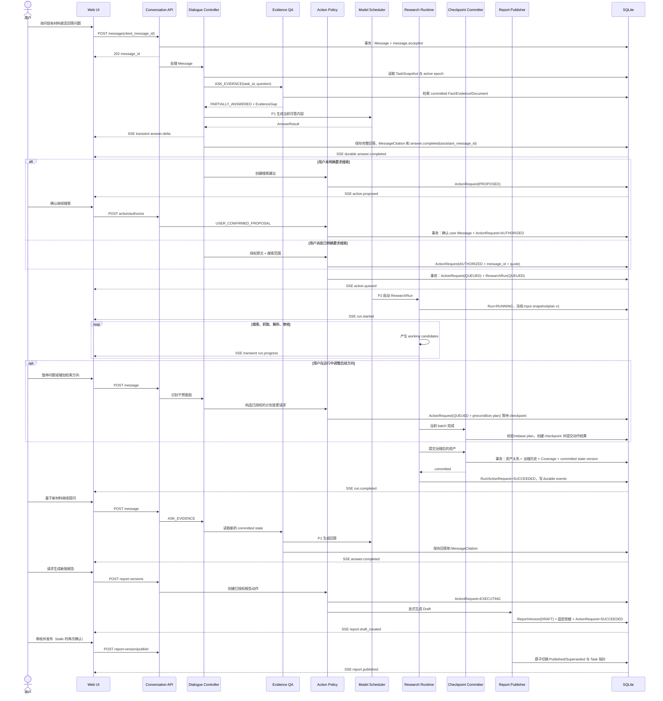

该图展示“材料不足后续研”的完整路径。材料足以回答时，流程在首次
`answer.completed` 结束；如果 `ActionRequest` 没有进入 AUTHORIZED，流程在
建议阶段结束，不允许创建 ResearchRun。重新提问不会自动复用过期授权。

## 12. Web 交互

桌面端目标布局：

```text
┌────────────┬────────────────────────┬────────────────────┐
│ 调研任务    │ 对话                    │ 当前任务            │
│            │                        │                    │
│ Task A     │ 用户问题与引用回答        │ 关键问题进度          │
│ Task B     │ 缺口与建议动作            │ 材料 / 证据 / 冲突    │
│ Task C     │ 运行进度与报告草稿提示      │ 报告版本              │
└────────────┴────────────────────────┴────────────────────┘
```

任务区仍按 `task_id` 切换。对话区是主要交互面；右侧任务区提供“概览、材料、
证据、报告”视图并可折叠。点击引用时展开材料侧栏并按 SourceLocator 定位，
展示：

- 标题、来源机构、类型、发布时间、抓取时间和原始 URL；
- 原文引用及页码、段落、文本行、图像区域或音视频时间段；
- 材料状态、Evidence 状态、关联问题和报告使用状态。

引用侧栏不显示阅读星级。材料页可以显示“阅读优先级 1–5”，tooltip 明确其
不代表可信度、事实真实性或证据质量。

运行中允许：

- 立即查看确定性状态；
- 排队进行 Evidence QA；
- 提交将在 checkpoint 应用的干预。

## 13. 报告生成与发布

ResearchRun 成功不会自动生成 ReportVersion。只有用户显式发起
`GENERATE_REPORT / REGENERATE_REPORT` ActionRequest，Report Publisher 才生成
Draft。创建新 Draft 时放弃先前的 current Draft。发布前必须验证：

- 报告文件哈希正确；
- 引用的 Fact/Evidence 均属于当前 Task；
- Evidence 精确引文仍与文档一致；
- `based_on_committed_state_version` 默认等于当前
  `committed_state_version`；若不相等，必须展示差异、重新校验依据，并由用户
  显式确认 stale 发布；
- 报告明确保留未回答问题、争议和证据缺口。

发布是用户显式操作。聊天中的“把第二段写得肯定一些”只能形成草稿预览或
ActionRequest，不能改变 Published Report，也不能改变 Evidence 状态。

## 14. 迁移策略

SQLite 在本次重构中一次性成为元数据真相源，不建立长期 JSON/SQLite 双写，
也不追求零停机迁移。首版本地部署要求停止服务后执行一次性迁移。

迁移流程：

1. 进入 maintenance mode，停止 Web 服务和后台 worker，确认没有 JSON writer；
2. 创建带 schema version 的空数据库；
3. 在单事务中导入现有 Task、Document、Fact、Evidence、Review、Coverage、
   MaterialDigest 和当前 Report binding；
4. 校验对象计数、外键、文件路径和 SHA-256；
5. 为每个 Task 创建 Conversation、首个 active epoch，以及
   `run_type=LEGACY_IMPORT / provenance=MIGRATED` 的 ResearchRun 占位记录；再用
   一个 `reason=legacy_import` 的 COMMITTED ResearchCheckpoint 关联导入资产并将
   `committed_state_version` 从 0 推进到 1；
6. 将当前报告导入为 Published ReportVersion，标记
   `publication_origin=LEGACY_MIGRATION`；有原始时间则保留，不用迁移时间冒充
   原发布日期；
7. 写入 migration-complete marker 与 schema version；
8. 切换配置到 SQLite 并启动新 runtime；
9. 原 JSON 保留为只读迁移备份，不再读取或写入，验收后统一归档。

导入器必须幂等：同一工作区重复执行只验证已有迁移，不重复创建业务对象。
任何校验失败都回滚数据库事务并保持服务停止；修复后可幂等重试或显式恢复旧
runtime。迁移记录只表达可证实的历史，不伪造旧 Run 边界或报告发布日期。
导入时可用一条 `previous_status=NULL / reason=legacy_import` 的状态迁移记录当前
Fact/Evidence 状态，但不推测或伪造迁移前的状态变化过程。

## 15. 故障与恢复

| 故障 | 行为 |
| --- | --- |
| 浏览器断开 | 丢弃 partial answer 并显示生成中；重放持久事件，answer.completed 后读取完整 Message |
| Dialogue 模型失败 | Message=FAILED，保留检索结果，允许重新回答 |
| Research 进程退出 | Run=INTERRUPTED 终止；未 checkpoint 资产不可用于 QA，重试创建关联的新 Run |
| 文件写入失败 | 数据库事务不登记文件，清理临时文件 |
| checkpoint 事务失败 | ResearchCheckpoint=FAILED、Run=FAILED，committed state 不变化 |
| 重启发现 STARTED checkpoint | 标记为 FAILED；未关联 committed version 的候选继续不可见 |
| 报告发布失败 | 旧 Published 版本和 Task 指针保持不变 |
| Action 建议失效 | ActionRequest=EXPIRED，旧按钮不可再次授权 |
| 用户取消回答 | 协作式停止 Message；独立 Action/Run 需单独取消 |

## 16. 安全边界

- Dialogue Retrieval 的每个 document/evidence ID 必须同时匹配 task_id；
- 原始材料仍视为不可信数据，进入模型前保留不可信内容包装；
- 继续研究复用 DNS pinning、SSRF、redirect、robots 和下载预算；
- MessageCitation 由服务端校验 task ownership、来源定位和哈希后绑定，模型不能
  生成可点击的任意本地路径；
- SQLite 参数全部使用绑定参数，不拼接用户输入；
- 大文件下载仍使用 attachment 和 `X-Content-Type-Options: nosniff`；
- 首版本地单用户不增加登录系统，但数据库和文件路径仍限制在工作区内。

## 17. 可观测性

业务轨迹必须能够直接回答：

```text
哪条 Message
→ 被识别为什么 DialogueIntent
→ 产生哪个 ActionRequest
→ 授权了哪个 ResearchRun
→ 使用哪个 SearchPlanVersion
→ 在哪个 ResearchCheckpoint 推进哪个 committed_state_version 并提交哪些资产
→ 形成哪个 ReportVersion
```

模型调用日志只用于技术诊断，不能替代上述业务关系。Fact/Evidence 的治理状态
迁移由 DomainStateTransition 完整记录 actor、reason、previous/new status、
committed_state_version 和时间；Message、ActionRequest、ResearchRun、
ResearchCheckpoint 与 ReportVersion 的生命周期由实体当前状态和持久业务事件
共同审计，不重复写入 DomainStateTransition。ReportVersion 和 MessageCitation
固定生成时的内容哈希，使历史回答与报告可重放，同时能够提示依据的当前治理
状态。

## 18. 验收标准

### 18.1 领域与数据一致性

- 数据库启用 WAL 和 foreign keys，迁移后无孤立外键；
- partial unique index 阻止一个 Task 同时存在两个 RUNNING ResearchRun、两个
  DRAFT 或两个 PUBLISHED ReportVersion，并阻止一个 Conversation 有两个 active
  Epoch；
- 同一 `client_message_id` 在一个 Conversation 内重试只产生一条 Message，Message
  sequence 单调且唯一；
- ResearchRun 的终态不能回到 QUEUED；重试必须创建带 `retry_of_run_id` 的新 Run；
- 每次 committed state 变化都能定位到唯一 ResearchCheckpoint、资产增量和状态
  迁移；消息、SSE 和报告发布不会推进该版本；
- Fact/Evidence 内容更新不能原地覆盖，治理状态变化均有
  DomainStateTransition；
- TaskSnapshot 删除后能够从数据库完整重建；
- 服务异常退出后，已提交消息、事件和 checkpoint 不丢失；
- 不存在运行期 JSON/SQLite 双写。

### 18.2 问答与引用

- 普通问题不会产生网络请求或 ResearchRun；
- 回答只检索当前 task_id 的 committed 资产；
- 所有事实性回答均有 MessageCitation，能够按材料类型定位到哈希验证后的文本
  行、页码、段落、图像区域或音视频时间段；
- 能按 Document/Evidence 反查引用过它的 Message，且跨 Task 引用被拒绝；
- 未审核材料明确标记为材料线索，不冒充正式证据；
- 材料不足时返回 `PARTIALLY_ANSWERED/NOT_ANSWERABLE` 和具体缺口；
- 清空上下文后模型不读取旧 epoch，审计仍可查询旧消息。

### 18.3 动作与运行

- 明确且无歧义的搜索指令直接形成 AUTHORIZED ActionRequest；自然语言授权原文
  必须是 `authorization_message_id` 指向的 user Message 子串，动作范围不得扩张；
- 一条 Message 触发多个 ActionRequest 时，每个动作分别保存授权方式、授权范围
  和授权原文；按钮确认保存 user Message 且不伪造 quote；
- 否定、假设、疑问、转述和撤回表达不能自动授权动作；
- 模糊缺口只形成 PROPOSED 请求，未经确认不联网；
- ActionRequest 前提版本变化时重新校验；已补齐缺口的建议进入 EXPIRED，不能
  创建重复 Run；
- MODIFY_SEARCH_PLAN 在 checkpoint 比较前置计划版本；兼容变更确定性 rebase，
  冲突变更进入 EXPIRED；
- 干预只在 checkpoint 应用，并产生新 SearchPlanVersion；
- 运行中未提交候选不会进入 Evidence QA；
- P1 问答优先于下一次 P2 调用，但不打断已经开始的 generation；连续三个 P1
  后，已等待的 P2 获得下一个空闲 slot。

### 18.4 报告与恢复

- 生成 Draft 不改变当前 Published Report；
- ResearchRun 成功不会自动生成 Draft，只有显式报告动作会生成；新 Draft 创建后
  旧 current Draft 进入 ABANDONED；
- 默认拒绝发布 based-on 版本落后的 Draft；stale 发布必须显式确认并重新校验
  依据；
- 发布事务失败时旧报告仍有效；
- 每个版本能还原其 run/fact/evidence 依据及生成时治理状态，并展示依据的当前
  状态变化；
- SSE 在回答生成中断线时丢弃 partial buffer，完成后用完整 assistant Message
  替换；token delta 和细粒度进度不写 SQLite；
- 浏览器刷新和服务重启后可以继续查看同一 Conversation。

### 18.5 迁移

- 迁移在服务和旧 writer 停止后执行，校验完成且存在 migration-complete marker
  才能启动 SQLite runtime；
- 重复运行迁移不会复制对象，失败不会留下可启动的半迁移数据库；
- 历史任务使用 `LEGACY_IMPORT` Run，历史报告保留可获得的原时间并标明迁移
  来源，不伪造完整运行轨迹。

## 19. 实施边界

该设计可拆为五个按依赖顺序交付的部分：

1. SQLite schema、迁移器和 repository 边界；
2. 持久 ResearchRun、ActionRequest、ResearchCheckpoint、状态历史与持久事件；
3. task-scoped Evidence QA、Conversation 和有界上下文；
4. 续研授权、调度器和运行中干预；
5. ReportVersion、发布事务和三栏 Web 工作台。

具体逐文件顺序、测试夹具和迁移回滚步骤由后续实施计划定义。本设计不授权
立即修改生产代码。
