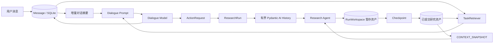

# 情报收集智能体的记忆与上下文管理

本文面向第一次接触智能体工程的开发者，也可以作为项目面试材料。文中所说的“记忆”不是一个单独的 Memory 类，而是由持久状态、对话摘要、检索结果、模型消息历史和运行时状态共同组成。

## 1. 一句话概括

系统不要求大模型永久记住研究过程，而是把可信事实写入持久存储，在每次模型调用前按需构建一个有界上下文。

这带来三个直接收益：

1. 进程重启后研究状态仍然存在。
2. 长对话不会把全部历史无限塞进模型窗口。
3. 对话回答只能看到已经正式提交的研究资产，运行中的半成品不会泄漏给用户。

## 2. 为什么不能把聊天记录直接当作记忆

大模型本身是无状态的。一次请求结束后，它不会自动保存事实。所谓“模型记住了”，实际通常是应用在下一次请求中重新发送了历史消息。

如果始终重放完整历史，会出现以下问题：

- 输入 token 和费用持续增长；
- 较旧但重要的事实可能被截断；
- 工具返回的大段网页正文会挤占推理空间；
- 模型曾经生成的错误结论可能在后续对话中不断传播；
- 进程重启后，纯内存历史无法恢复。

因此，本项目把“事实真相”和“模型上下文”分开管理：事实进入持久状态，模型上下文只是持久状态的临时投影。

## 3. 总体架构



系统可以理解为五层记忆。

| 层次 | 主要实现 | 生命周期 | 是否直接进入模型上下文 |
|---|---|---|---|
| 业务长期记忆 | Task、Document、Fact、Evidence、Review、Coverage、Report | 跨进程、跨 Run | 通过快照或检索按需进入 |
| 对话长期记忆 | Message、ConversationEpoch.summary | 跨进程 | 摘要和最近消息进入 |
| Run 工作记忆 | Pydantic AI `message_history`、RunWorkspace | 单次研究运行 | 经过压缩后进入 |
| 可提交研究状态 | Checkpoint、CommittedResearchSnapshot | 跨 Run、可审计 | 下一轮快照和检索可见 |
| 临时运行状态 | asyncio Task、取消令牌、SSE 订阅者 | 当前进程 | 不进入模型上下文 |

## 4. 业务长期记忆：可信事实的唯一来源

持久状态的主要接口位于 `StateStore`。它是一个较深的模块：调用者只操作消息、Run、Checkpoint 和版本等接口，SQLite 事务、状态迁移和一致性校验隐藏在实现内部。

相关代码：

- `src/intel_agent/state_store.py`
- `src/intel_agent/state_db.py`
- `src/intel_agent/models.py`

重要对象包括：

- `Conversation`：一个用户可见的对话，可绑定一个研究任务；
- `Message`：不可变的用户消息或已完成的助手回答；
- `ResearchRun`：一次可审计的研究尝试；
- `RunWorkspace`：当前 Run 尚未提交的暂存资产；
- `ResearchCheckpoint`：一次原子提交边界；
- `CommittedResearchSnapshot`：某个提交版本下的固定读取视图。

研究工具生成的新文档、事实和证据不会立即成为全局可见状态。它们先进入当前 Run 的工作区，只有 Checkpoint 成功提交后，`current_committed_state_version` 才会前进。

这个设计类似数据库事务：

```text
已提交版本 v3
    + 当前 Run 暂存修改
    + Checkpoint 校验
    = 新的已提交版本 v4
```

如果 Run 失败、取消或被停止，未提交资产不会污染上一版可信状态。

## 5. 对话记忆：摘要加最近原文

任务对话由 `ConversationRuntime` 编排，模型提示由 `DialogueEngine` 构建。

相关代码：

- `src/intel_agent/conversation.py`
- `src/intel_agent/dialogue.py`
- `src/intel_agent/state_store.py`

### 5.1 一次对话请求如何组装

每次回答会向模型提供四部分内容：

1. 当前任务快照：主题、目标、阶段、问题和 Run 状态；
2. 对话摘要：最多保留 4,000 个字符；
3. 最近消息：最多 10 条，每条最多 2,000 个字符；
4. 检索段落：最多 8 条，每条引文最多 4,000 个字符。

对话模型没有搜索或写入研究状态的工具。它只能基于这些输入回答，并返回经过 Pydantic 校验的 `DialogueDecision`。

### 5.2 增量摘要

完整消息始终持久化，摘要只是给模型使用的压缩视图，不会删除审计历史。

当前规则如下：

- 未摘要消息不超过 12 条时不触发摘要；
- 始终保留最近 8 条消息原文；
- 每次最多摘要 12 条新增消息；
- 新摘要的输入是“上一次摘要 + 尚未摘要的新消息”；
- `summary_through_sequence` 记录摘要已经覆盖到哪条消息。

修复前，系统每次都会重新摘要全部旧消息，长对话下摘要输入会线性增长。现在摘要只处理新增区间：

```text
第一次：消息 1..6  → 摘要 A，through=6
第二次：摘要 A + 消息 7..12 → 摘要 B，through=12
```

摘要提示明确禁止保存研究事实、证据结论、URL 和模型推测。摘要只保存用户约束、输出偏好、已讨论问题、未解决问题和待执行动作。研究事实必须重新从持久资产检索。

## 6. 对话检索：只读取已提交资产

`TaskRetriever` 是对话与研究资产之间的检索 seam。其接口只接收 `task_id`、用户查询和结果数量，内部完成资产可见性、文件完整性检查、分段和排序。

相关代码：

- `src/intel_agent/retrieval.py`

当前实现使用轻量级词法重叠评分：

1. 将用户问题分词；
2. 检索已提交且审核通过的 Evidence；
3. 将已提交 Document 按 12 行分块；
4. 计算查询词与候选文本的重叠数量；
5. Evidence 优先于普通材料线索；
6. 返回 Top 8。

每份文档最多读取 200,000 个字符。没有引入向量数据库，因为当前本地单任务规模下，词法检索更简单、可解释，也没有额外部署成本。

最重要的不变量是：对话检索只读取 committed assets。当前研究 Run 的 staged assets 只有研究智能体自己可见，用户对话在提交前看不到它们。

## 7. 研究智能体上下文：历史压缩加状态快照

研究智能体通过 Pydantic AI 运行。`ProcessHistory` 在每次模型请求之前调用项目自己的历史处理函数。

相关代码：

- `src/intel_agent/context.py`
- `src/intel_agent/agent.py`
- `src/intel_agent/runner.py`
- `src/intel_agent/config.py`

### 7.1 历史压缩

`compact_message_history` 执行以下工作：

1. 删除前一轮注入的旧 `CONTEXT_SNAPSHOT`；
2. 在最新请求中注入新快照；
3. 未超过预算时保留完整历史；
4. 超过预算时保留初始任务和最近的完整工具交换；
5. 避免保留找不到对应 ToolCall 的孤立 ToolReturn。

代码中的默认 32K 上下文配置对应：

| 配置 | 默认值 |
|---|---:|
| 模型上下文窗口 | 32,768 tokens |
| 历史序列化预算 | 49,152 bytes |
| 单个工具内容预算 | 8,192 bytes |
| 主模型最大输出 | 8,192 tokens |
| 审核模型最大输出 | 512 tokens |

历史预算使用字节而不是精确 tokenizer。这个值故意保守，为系统提示、工具定义和模型输出预留空间。
`config.example.yaml` 为本地长上下文模型演示覆盖成了 262,144 tokens；部署时必须按实际模型窗口调整，不能把示例值理解成所有模型的安全默认值。

### 7.2 `CONTEXT_SNAPSHOT`

历史消息可能被删除，因此研究智能体不能只依赖聊天记录恢复任务进度。系统会从持久状态重新生成一个确定性的 JSON 快照，包含：

- Task 阶段、问题和采集统计；
- 最近归档文档；
- 已读取文档 ID；
- 待审核和已审核 Evidence；
- 最多 20 条活跃 Fact；
- 最新 Coverage；
- 下一步必须执行的动作。

快照同时遵守以下硬限制：

- 最大 16,384 bytes；
- 每类 ID 最多列出 20 个，同时保留总数；
- 问题文本最多 500 个字符；
- Fact statement 最多 160 个字符；
- 归档文档最多 8 个。

如果完整快照仍超出预算，系统会退化为合法的最小 JSON，优先保留任务身份、阶段、采集状态、数量和下一步动作；极小预算下还会按优先级继续删减非身份字段。快照不会通过截断字符串的方式产生无效 JSON。

`next_action` 还承担了小模型导航作用。例如：存在待审核证据时，快照会要求先执行 `evidence_audit`，避免模型继续盲目搜索。

## 8. 运行恢复与临时状态

以下内容只存在于进程内：

- 正在运行的 asyncio Task；
- CancellationToken；
- 对话流式输出订阅者；
- 当前 Run 已读取文档的集合。

这些对象不是业务记忆。进程重启后，`ConversationRuntime.recover()` 根据 SQLite 中的 Message processing attempt、ActionRequest 和 ResearchRun 状态重新调度可以恢复的工作。

已经进入 SQLite 或文件资产的内容不会丢失；纯粹的模型推理中间状态不会尝试恢复。失败的执行应创建新的 Run 或 Retry，而不是伪装成原 Run 从任意推理 token 继续。

## 9. 关键设计原则

### 9.1 持久事实优先于模型回忆

Fact、Evidence 和 Document 是事实来源；摘要和消息历史只是导航材料。如果两者冲突，应以经过校验的持久研究资产为准。

### 9.2 完整历史用于审计，有界视图用于推理

数据库可以保存全部消息和事件，但每次模型调用只获得一个有界视图。存储容量和模型上下文容量是两个不同问题。

### 9.3 可见性由提交版本决定

研究智能体可以看到“已提交版本 + 自己的暂存修改”；用户对话只能看到已提交版本。这避免用户读取半完成或最终会回滚的研究结果。

### 9.4 不为“以后可能需要”引入基础设施

当前没有 LangChain Memory、LangGraph Checkpointer、Redis、外部向量数据库或独立 Memory Server。Pydantic AI 的历史处理接口、SQLite 和已有文件存储已经覆盖当前需求。

## 10. 当前局限

### 10.1 摘要仍由模型生成

提示已经禁止记录研究事实，但摘要结果目前仍是普通文本，没有结构化 schema 校验。模型可能遗漏用户偏好或未解决问题。

只有在真实评测证明摘要漂移明显时，才值得把摘要升级为结构化对象，例如 `user_constraints`、`open_questions` 和 `pending_actions`。在此之前增加修复 Agent 或摘要工作流会引入不必要复杂度。

### 10.2 字节预算不是精确 token 预算

中文、英文、JSON 和不同 tokenizer 的 bytes/token 比例不同。当前保守预算能防止大多数溢出，但不能等价于模型供应商的精确 token 计数。

只有当生产日志出现上下文溢出或浪费明显时，才应引入模型对应 tokenizer。

### 10.3 词法检索存在召回上限

同义词、缩写和跨语言表达可能无法通过词面重叠命中。文档数量增大后，逐文档扫描的延迟也会上升。

建议在满足任一条件后再考虑向量检索：

- 单任务文档达到数千份；
- P95 检索延迟超过目标；
- 有标注评测证明 Recall@8 无法满足要求。

即使增加向量检索，也应作为 `TaskRetriever` seam 的另一个 Adapter，而不是让向量数据库成为新的事实来源。

### 10.4 Epoch 重置尚未进入产品流程

`StateStore.start_epoch()` 可以开始新的上下文段，但当前生产调用链没有使用它。归档和恢复对话也不会自动创建新 Epoch。

在出现明确的“保留任务但清空对话上下文”产品需求前，不应围绕 Epoch 增加更多管理界面。

### 10.5 部分 Run 工作记忆不会跨重启恢复

例如已读取文档 ID 是单次进程内工作记忆。重启后新的执行可能重新读取一次文档，但不会损坏已经提交的事实状态。这是用少量重复工作换取简单恢复模型的有意取舍。

### 10.6 调试轨迹需要单独的保留策略

实验模式可以保存完整模型对话和 trajectory。这些文件不参与正常上下文构建，但长期运行时仍可能占用磁盘并包含敏感输入。目前需要部署方自行制定清理周期。

## 11. 测试覆盖

关键行为由以下测试保护：

- `tests/test_context.py`：历史压缩、工具调用配对、快照资产可见性、ID 上限和字节硬上限；
- `tests/test_conversation.py`：消息持久化、恢复和增量摘要区间；
- `tests/test_dialogue.py`：提示构建、引用白名单、摘要记忆约束；
- `tests/test_state_store.py`：版本、Checkpoint、Workspace 和 Epoch 状态；
- `tests/test_retrieval.py`：仅检索已提交资产及引用完整性。

## 12. 面试讲述模板

### 12.1 30 秒版本

> 这个项目没有把完整聊天记录直接当作智能体记忆。我把记忆分成持久业务状态、对话摘要、单次 Run 历史和临时运行状态。事实和证据通过 SQLite、文件资产和 Checkpoint 持久化；每次模型请求只注入增量摘要、最近消息、Top-K 已提交材料以及一个有 16KB 硬上限的状态快照。这样既支持重启恢复，也避免长任务上下文无限增长和未提交结果泄漏。

### 12.2 2 分钟版本

> 项目的核心问题是，情报调研通常持续很多轮，搜索和网页正文又非常长，不能依赖大模型自己记住全部过程。我把“事实真相”和“推理上下文”拆开。Document、Fact、Evidence、Coverage 和 Report 是长期业务记忆，由 StateStore 管理；ResearchRun 的修改先进入隔离的 Workspace，通过 Checkpoint 后才成为新版本。
>
> 对话侧保存完整消息用于审计，但模型只看到滚动摘要、最近 10 条消息和最多 8 条已提交材料。摘要是增量生成的，始终保留最近 8 条原文，也明确禁止把研究事实写入摘要。
>
> 研究 Agent 侧利用 Pydantic AI 的 ProcessHistory 压缩工具调用历史，并在每轮注入从持久状态重建的 CONTEXT_SNAPSHOT。快照限制为 16KB，各类 ID 最多 20 个，超限时退化为合法的最小 JSON。这样历史可以删除，但任务阶段、覆盖度和下一步动作不会丢失。
>
> 当前没有引入 LangGraph 或向量数据库，因为 SQLite、Pydantic AI 历史处理和词法检索已经满足当前规模。未来只有在召回率或延迟指标证明不足时，才会在 TaskRetriever seam 增加向量检索 Adapter。

### 12.3 常见追问

**为什么不用 LangGraph？**

当前复杂度主要来自研究状态和证据一致性，而不是图编排。状态已经通过 ResearchRun、ActionRequest、Checkpoint 和显式状态迁移表达，引入 LangGraph 会形成第二套状态与恢复语义。

**为什么摘要不能保存研究结论？**

摘要是模型生成文本，缺少证据完整性约束。让事实进入摘要会形成难以审计的“影子知识库”。研究结论应该由 Fact、Evidence 和引用文档提供。

**如何防止上下文爆炸？**

系统同时限制历史序列化字节、工具返回大小、最近消息数、检索数量、字段长度、ID 数量和快照总字节，并在历史压缩后重新注入持久状态快照。

**如何保证重启后不失忆？**

消息、处理尝试、Action、Run、事件、Checkpoint 和已提交资产都持久化。重启后运行时只重建 asyncio 调度和取消令牌；事实状态不依赖进程内对象。

**为什么不直接保存模型全部思维链？**

系统保存可审计的工具调用、状态变化和结果，不把不可验证的隐式推理当作业务事实。恢复依赖持久状态和新 Run，而不是复活模型内部思维。

## 13. 代码阅读顺序

初学者建议按以下顺序阅读：

1. `src/intel_agent/models.py`：先理解领域对象；
2. `src/intel_agent/state_db.py`：了解持久结构和约束；
3. `src/intel_agent/state_store.py`：了解状态接口和事务；
4. `src/intel_agent/conversation.py`：理解一条用户消息如何流转；
5. `src/intel_agent/dialogue.py`：理解对话提示和摘要；
6. `src/intel_agent/retrieval.py`：理解对话如何获得可信材料；
7. `src/intel_agent/context.py`：理解研究历史压缩和状态恢复；
8. `src/intel_agent/runner.py`：最后看完整研究 Run 的循环。

理解这套设计的关键不是记住类名，而是记住一句话：完整状态保存在系统里，模型每次只得到完成当前动作所需的最小上下文。
