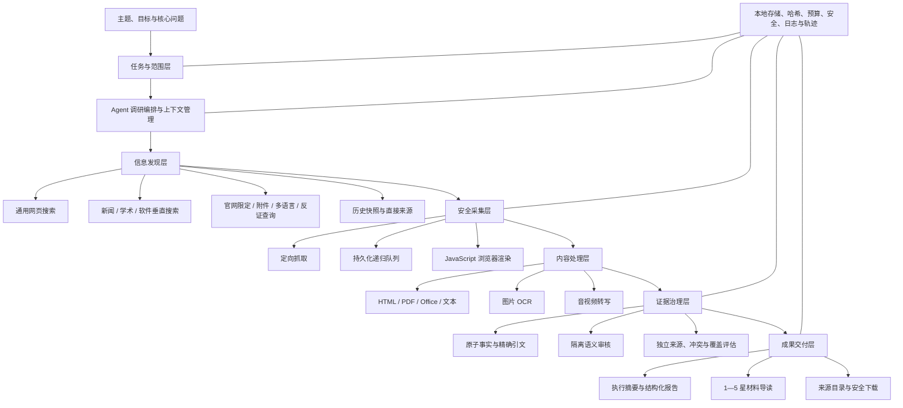

# 情报调研智能体建设进展与价值汇报

## ——围绕“广、深、准、用”建设本地公开信息调研能力

**汇报对象：** 项目管理层及建设决策人员  
**汇报时间：** 2026 年 8 月  
**建设范围：** 面向无需登录的互联网公开信息，完成主题检索、材料采集、内容提取、证据核验和结构化调研报告交付

---

## 一、汇报摘要

本项目建设的不是一个“能够联网回答问题的聊天机器人”，而是一套面向正式调研工作的本地情报生产系统。

用户给出一个调研主题或若干核心问题后，系统能够自主规划检索方向，调用多类公开搜索渠道，进入网页、附件和多媒体原件继续采集，将材料转化为可定位的事实与引文，经过独立审核和覆盖评估后，形成带来源目录、阅读推荐、信息缺口和局限说明的结构化公开信息调研报告。

项目的总体建设目标可以概括为四个字：

| 目标 | 业务含义 | 不是简单追求 | 系统要解决的核心问题 |
| --- | --- | --- | --- |
| **广** | 重要问题、来源类型、语言、时间和材料形态得到充分覆盖 | URL 数量越多越好 | 有没有漏掉关键来源和必要视角 |
| **深** | 从搜索入口深入正文、附件、动态页面及原始材料 | 链接跳数越深越好 | 是否真正读到了决定结论的材料内容 |
| **准** | 结论有原文依据、来源独立、口径清楚，并能披露冲突和缺口 | 模型表达得像真的 | 每个重要结论能否被复核和解释 |
| **用** | 管理层快速掌握结论，业务人员能够选择原文继续阅读 | 只生成一篇长报告 | 产物能否直接进入调研、汇报和复核流程 |

当前项目已经完成从主题输入到报告输出的核心闭环，并在云端模型和本地 Qwen 27B 模型上完成真实任务验证；递归采集、动态网页、多类型文档、证据审核、材料推荐、本地 Web 工作台、上下文管理和运行轨迹均已形成可运行能力。最近一轮又补充了新闻、学术、软件和历史快照等垂直检索入口，以及按证据缺口自动补源的调度机制。

项目目前已经从“功能可跑”进入“效果提升与规模化验收”阶段。下一步重点不再是无边界增加抓取量，而是提高关键来源召回率、独立交叉验证率、材料到证据的转化率，以及不同主题、不同模型下的稳定完成率。

---

## 二、为什么要建设专用情报调研智能体

通用搜索和云端大模型可以快速给出答案，但正式情报调研还面临四类缺口。

第一，通用模型容易把“搜索到”当成“调查清楚”。搜索摘要、转载文章和原始文件在回答中经常处于同一层级，用户很难判断哪些内容真正值得采用。

第二，关键信息往往不在搜索结果标题中，而在政府或企业官网的附件、PDF 表格、扫描件、发布会音视频、动态加载页面和下级栏目中。只读取搜索摘要，无法完成有深度的调研。

第三，正式汇报不能只依赖语言模型的流畅表达。重大数字、企业单方披露、媒体转述和分析推断需要不同的验证规则，并应保留原始材料、精确引文和审核记录。

第四，云端对话通常只留下最终回答，过程材料和调研方法难以沉淀。对于需要反复更新的行业、政策、企业和事件专题，甲方真正需要的是可持续积累的材料库、证据链和调研成果。

因此，本项目把模型定位为“调研组织者”，把搜索、抓取、归档、核验、停止条件和报告完整性交给受约束的系统工具。核心价值不是单次生成一篇文字，而是把公开信息调研的方法固化为可重复执行、可观察、可审计的生产流程。

---

## 三、“广、深、准、用”的总体建设思路

### 3.1 广：从搜索数量转向问题与来源覆盖

“广”首先是调查维度完整，而不是简单抓取更多网页。系统围绕每个核心问题组织查询，并区分一手来源、独立验证来源、结构化数据、附件、新闻、学术、软件和反证等来源角色。

当前已经形成以下能力：

- 通用网页搜索支持 SearXNG、Bing、百度及百度新闻等入口，并使用确定性查询矩阵补充官网限定、文件类型、中英文、结构化数据和反证查询。
- 新增新闻垂直检索，采用“百度新闻 → 360 新闻 → SearXNG 新闻”的国内优先级联，GDELT 作为可选的境外网络补充。
- 新增学术垂直检索，由 arXiv 与 Crossref 并行提供基础结果，结果不足时再使用 Semantic Scholar 匿名接口补充。
- 新增软件与开源情报检索，覆盖 GitHub 仓库、Issue 和 Pull Request；匿名额度受限时可降级到 Gitee 或网页检索。
- 新增 Wayback 历史快照兜底，在公开链接失效时尝试恢复历史原文。
- 所有新增 Provider 均执行准入控制：生产搜索栈只接受匿名、无需付费、无需密钥的公开能力，避免隐性引入采购和凭据依赖。
- 当覆盖评估发现学术、新闻或软件来源缺失时，系统可以按当前证据缺口自动调用对应垂直能力，而不是完全依赖模型记住“还要换一种来源”。

广度控制同时包含去重与公平约束。系统对 URL 做规范化，同一任务硬去重；对论坛、社区和普通域名设置占比或入队上限，对政府、官网和投资者关系等一手来源保留优先通道。这样既扩大来源面，又防止单一论坛、转载站或导航页占满采集预算。

### 3.2 深：从链接入口进入原始材料

“深”表示能够越过入口页，进入真正承载信息的原始材料。系统采用“定向抓取优先、必要时递归采集”的分层策略：普通任务直接抓取高价值候选；复杂任务启用持久化采集队列，从 HTML、PDF 和 Office 文件中继续发现相关链接，并支持中断恢复。

当前深度能力包括：

- 持久化抓取队列，支持 URL 规范化、循环去重、父子来源链、深度和优先级记录。
- 默认可配置最大深度、URL 数、任务总下载量、单文件大小、全局并发、单域并发和请求间隔。
- 同任务去重、跨任务缓存和过期条件请求，减少重复下载。
- 对静态正文不足的 JavaScript 页面，可按需启动隔离 Chromium，执行渲染后再提取正文和动态链接。
- 从网页的链接以及图片、音频、视频、对象和嵌入标签中发现附件或媒体。
- 支持 PDF、DOC/DOCX、XLS/XLSX、PPT/PPTX、TXT、CSV、PNG、JPEG、WebP、TIFF、MP3、WAV、M4A、OGG、FLAC、MP4、WebM 和 MOV 等材料。
- 图片使用 Tesseract OCR；音视频使用 FFmpeg 和 faster-whisper 转写；旧式 Office 文件可通过 LibreOffice 转换。
- 处理器缺失时仍保留原件，并将提取状态标记为不可用，避免丢失材料；不可用正文不能进入正式证据链。

深度采集并不等于无边界爬网。系统始终遵守 robots.txt，并执行 DNS pinning、SSRF 防护、重定向逐跳检查、域名限速、下载预算和内容类型限制。当前边界仅覆盖无需登录的公开页面，不把绕过登录、验证码或访问控制作为常规能力。

### 3.3 准：从“模型认为正确”转向“证据可以证明”

“准”是本系统区别于普通联网问答的核心。系统明确规定：搜索摘要只是候选线索，不能直接成为正式证据。材料必须先归档原件和提取正文，再保存能够逐字定位的引文，最后由隔离的审核模型判断引文是否完整支持事实。

正式结论遵循以下证据链：

```text
报告结论 → 原子事实 → 精确引文 → 原文行号或时间戳
         → 已归档正文 → 原始材料 → SHA-256 完整性校验
```

系统按声明性质实施不同规则：

- **一手事实**：法规、公告、财报等一手材料直接披露的内容，可由匹配的一手来源支持，但必须标明尚未独立验证。
- **交叉验证事实**：重大数字、争议性信息或一般性结论，要求达到任务设定的独立来源组门槛。
- **来源转述**：主体或媒体的单方说法可以保留，但报告必须明确“据某来源”，不能伪装成系统确认的事实。
- **分析推断**：必须绑定至少两个已经满足各自证据规则的事实，并明确标识为分析判断。

独立审核模型对候选引文给出 `full`、`partial`、`irrelevant` 或 `contradicts` 结果，只有 `full` 才能计入覆盖。审核并发和单次超时受控，已完成审核增量落盘，避免长尾请求拖住整个任务。

覆盖评估持续判断每个问题是已回答、部分回答、未回答还是存在冲突，并综合考虑来源独立性、来源质量、时间范围、待审核证据和矛盾材料。达到标准时生成充分报告；预算耗尽或连续无进展时生成 `with_gaps` 报告，明确披露没有查清的内容，而不是用模型语言补齐空白。

报告、覆盖快照和引用文档哈希相互绑定。证据、冲突、原文或报告在任务完成前发生变化时，系统拒绝错误完成，保证最终交付物与审核时的材料状态一致。

### 3.4 用：从“给出答案”转向“支持阅读和决策”

系统主产物是一份结构化公开信息调研报告，而不是一段对话回答。报告包含：

- 执行摘要和调研范围；
- 按核心问题组织的发现；
- 综合结论及其推理依据；
- 分歧、不确定性和明确局限；
- 每份材料的 1—5 星阅读推荐和一句话评价；
- 优先阅读清单、材料摘要和完整来源目录。

星级只表达材料对当前任务的阅读价值，不重复设计“可信度标签”：5 星表示直接支撑已审核核心发现，4 星表示含候选证据，3 星表示相关背景，2 星表示与核心问题关联有限，1 星表示采集或提取失败。用户可以先看执行摘要，再按星级选择原文；管理层、业务人员和复核人员由此共享同一套材料底座。

系统同时提供 CLI、本地 Web 工作台、FastAPI 接口和 SSE 实时进度。任务、原件、正文、事实、证据、审核、覆盖和报告均保存在本地工作区；运行可以取消并从已保存状态恢复。决策轨迹和技术轨迹记录每一步“为什么执行、执行了什么、结果如何”，支持问题复盘、模型比较和后续微调数据积累。

---

## 四、系统总体架构

系统采用“Agent 自主编排 + 确定性质量门控 + 本地证据底座”的分层架构。



### 4.1 核心模块及职责

| 模块 | 主要职责 | 对“广、深、准、用”的贡献 |
| --- | --- | --- |
| 任务与范围 | 保存主题、目标、问题、时间、地区、语言、充分性标准和预算 | 防止调查目标在长任务中漂移 |
| Agent 编排 | 选择查询、抓取、阅读、取证和停止动作 | 使调研过程能够根据当前缺口动态推进 |
| 上下文管理 | 支持 16K/32K/64K/128K/256K 档位，裁剪对话并从持久状态重建任务 | 小上下文和本地模型也能完成长任务 |
| 搜索与候选治理 | 通用搜索、查询矩阵、垂直 Provider、去重、来源角色和候选缓存 | 扩大有效覆盖，而不是扩大噪声 |
| 安全采集 | DNS pinning、SSRF 防护、robots、限速、重试、字节和并发预算 | 在公开互联网中可控、可恢复地获取原件 |
| 动态与多媒体处理 | Chromium 渲染、PDF/Office 提取、OCR、音视频转写 | 深入传统网页抓取无法读取的材料 |
| 事实与证据 | 原子事实、逐字引文、行号或时间戳、原文哈希 | 形成可核查的最小事实单元 |
| 审核与覆盖 | 独立语义审核、来源组门槛、冲突管理、缺口和停止判定 | 阻止不充分事实进入正式结论 |
| 报告与材料导读 | 结构化报告、引用目录、材料摘要、阅读星级 | 降低管理者理解和业务人员选读成本 |
| Web 与接口 | 任务创建、实时进度、任务详情、报告、材料下载和系统状态 | 支撑本地试用及后续业务系统集成 |
| 实验与可观测 | 运行日志、增量轨迹、状态快照、评分表和模型对比 | 让效果提升和模型选型有数据依据 |

---

## 五、当前项目进展

### 5.1 已形成完整主链

目前已经具备“主题输入 → 问题规划 → 公开搜索 → 原件归档 → 正文提取 → 事实和引文 → 语义审核 → 覆盖判断 → 材料导读 → 正式报告”的完整执行路径。

| 能力域 | 当前状态 | 已落地内容 | 当前成熟度判断 |
| --- | --- | --- | --- |
| 主题任务与 Agent | 已完成主链 | 主题式创建、用户问题冻结、范围与预算、阶段门控、自动续跑 | 可用于真实专题试验 |
| 通用搜索与查询控制 | 已完成主链 | 多引擎、确定性查询矩阵、来源提示、搜索转抓取门禁 | 可用，仍需持续优化实时召回 |
| 垂直搜索 | 新增完成 | 新闻、学术、GitHub/Gitee、Wayback、Provider 准入和缺口驱动补源 | 已自动化验证，待新一轮真实联网复测 |
| 递归与动态网页采集 | 可用 | 持久化队列、去重、缓存、断点恢复、Chromium 按需渲染 | 工程能力已具备，需扩大真实 JS 样本验收 |
| 多媒体处理 | 可用 | PDF、Office、OCR、音频和视频转写、处理器缺失降级 | 生产链路已打通，格式覆盖样本仍需补齐 |
| 证据治理 | 已完成主链 | 原子事实、精确引文、独立审核、交叉验证、冲突和覆盖评估 | 当前系统最成熟的核心能力之一 |
| 报告与阅读辅助 | 已完成 | 正式报告、诚实缺口、材料摘要、1—5 星推荐、来源目录 | 已在真实任务生成产物 |
| 本地模型与上下文 | 已验证 | OpenAI 兼容接口，本地 Qwen 27B 全流程，16K—256K 可配置上下文 | 能跑通，效率和策略遵从仍需优化 |
| Web、接口与可观测 | 已完成主链 | FastAPI、React 工作台、SSE、日志、增量轨迹和安全下载 | 可支撑本地演示与试运行 |
| 评测体系 | 已建立 | Benchmark、运行清单、评分表、冻结材料/真实联网模式、模型对比脚本 | 已能记录结果，样本规模尚不足以定型选模 |

### 5.2 当前工程验证

在当前 `main` 分支上，后端测试共收集 437 项，实测结果为 **436 项通过、1 项跳过**。测试覆盖任务、上下文、搜索 Provider、抓取、安全、动态网页、多媒体、证据审核、覆盖评估、报告、轨迹和 Web 接口等关键路径。

其中，针对最近新增的搜索 Provider、深度工作流、覆盖评估、报告和上下文管理执行了专项回归，**105 项全部通过**。这说明新增垂直检索和缺口驱动机制已经通过工程层验证，但仍需通过真实联网专题证明对最终覆盖质量的增益。

---

## 六、已有实验效果

### 6.1 搜索与采集质量从“堆数量”转向“控制有效语料”

项目通过连续真实联网实验逐步纠正了链接农场、论坛洪泛、门户导航和无关图片占用预算等问题。

| 实验改进 | 实测变化 | 说明 |
| --- | --- | --- |
| 深层链接相关性门禁 | 无关深层资源由 48 条降至 0；语料由 44 份收敛为 10 份高相关材料 | 证明减少噪声比单纯扩大抓取量更有效 |
| 同轮证据产出 | 活跃事实由 16 增至 22，证据由 18 增至 29 | 采集预算更多转化为可用内容 |
| 运行效率 | 耗时降低 74%，Token 消耗降低 53% | 相关性控制同时改善速度和模型成本 |
| 查询矩阵 | 确定性执行 22 条查询，包含 8 条官网限定、2 条附件查询及英文查询 | 搜索广度不再完全依赖模型临场发挥 |
| 来源多样性 | 有效域数量由 5.73 提升至 7.89，政府来源由 2 个提升至 7 个 | 来源覆盖从“域名数量”转向“有效独立来源” |

这些结果说明，系统已经形成一条重要经验：**材料数量不是目标，问题覆盖、来源质量和证据转化才是目标。**

### 6.2 交叉验证门控开始发挥作用

在早期实验中，模型容易用单一来源形成大量结论。引入事实登记门控和独立来源补证机制后，实验中的双源率由 0 提升至 86.7%，来源组由 5 增至 7，覆盖缺口分数由 25 降至 16。

最终整合实验中，前两大来源域占比降至 34.3%，有效域数量达到 10.47，来源组达到 8；9 项综合阈值中有 7 项达到目标。尚未达标的最大单域占比为 17.1%，双源率为 66.7%，表明来源多样性已有明显改善，但稳定交叉验证仍是后续“准”的重点。

### 6.3 多媒体链路已经打通，但真实样本覆盖仍不足

专项实验已经在生产处理链路中成功完成三类固定材料：

- PDF 使用 PyMuPDF 提取正文；
- 图片使用高质量中文 Tesseract 语言数据完成 OCR，并通过质量门控；
- 视频通过 FFmpeg 和 Whisper 完成转写，并通过文本质量门控。

系统也已具备 Office、音频和其他受支持格式的处理实现及自动化测试。需要客观说明的是，真实公开专题中的 Office、独立音频和 JavaScript 渲染样本仍然偏少，当前结果证明了“链路能工作”，尚不能证明“所有格式在大规模真实网页中都有稳定召回”。

### 6.4 云端模型和本地模型均已完成真实报告交付

同一“低空经济”专题的真实运行结果表明，模型层已经具备可替换性。

| 实验 | 部署方式 | 运行耗时 | 模型请求 | Token | 结果 |
| --- | --- | ---: | ---: | ---: | --- |
| 046 | 云端 DeepSeek | 790.5 秒 | 27 | 349,620 | `done/with_gaps`，生成正式报告 |
| 050 | 本地 Qwen 27B AWQ | 1,273.0 秒 | 82 | 1,001,265 | `done/with_gaps`，生成正式报告 |

本地 Qwen 27B 已经能够完成搜索、阅读、取证、审核、覆盖判断和报告生成的完整闭环，证明系统不依赖单一云端模型。与此同时，本地模型使用了约 3 倍模型请求和 Token，且对工具纪律和交叉验证的遵从仍弱于云端模型。这为后续模型选择、提示优化、蒸馏和微调提供了明确的量化方向：不能只比较文本观感，还要比较有效完成率、证据质量、工具调用效率和单位报告资源消耗。

### 6.5 256K 冻结材料评测验证了上下文稳定性和诚实交付

在固定 5 个政府公开页面、2 个固定问题、搜索关闭的 256K 上下文实验中：

- DeepSeek V4 Flash 连续 3 次均到达 `done`；单次耗时为 225.0—463.1 秒，其中 1 次达到充分覆盖、2 次以缺口报告完成。
- DeepSeek V4 Pro 已分析的一次运行达到充分覆盖，形成 11 条活跃事实，自动化代理指标中的事实支持率为 73.33%。
- 各次运行均未发生上下文溢出，报告结构和结论追溯门禁通过。
- 修复前同类任务在 586 秒仍停留于采集阶段；完成问题冻结、审核并发与超时、增量轨迹及确定性收敛后，038 号复验在 233.3 秒完成。

上述评测采用冻结材料，不能用于评价互联网搜索召回；部分评分仍是自动化代理指标，尚未经过盲评专家确认。它主要证明了长上下文、证据审核和任务收敛机制能够稳定工作。

### 6.6 报告已经能够体现材料覆盖和阅读价值

052 号运行已经生成一份包含执行摘要、按问题发现、局限、材料导读和来源目录的报告。报告登记 53 份材料，其中包括 2 份 PDF、1 份 JPEG 和 40 份 HTML，并从中形成了投融资和企业商业化相关的可引用发现。

该产物也暴露出当前仍需修复的问题：同一 URL 可能以多个引用编号重复出现，部分关键事实仍为单源，且该次运行没有完整结束清单，不能视为正式验收通过。这说明系统已经能够生产可阅读成果，但报告去重、终态完整性和独立验证仍需继续收敛。

---

## 七、项目已经形成的技术与业务壁垒

### 7.1 不是单一模型能力，而是一套证据生产流程

基础模型可以替换，但任务状态、来源策略、材料库、证据规则、覆盖门控和报告接口能够长期保留。模型升级不会推倒已经积累的情报资产和方法体系。

### 7.2 从搜索到证据的闭环数据可以持续积累

每次运行都可以记录查询、候选、抓取、阅读、证据、审核、覆盖、报告和资源消耗。成功案例可以形成范式，失败案例可以直接变成回归测试和后续微调数据。这种真实过程数据比单纯收集问答文本更适合优化调研 Agent。

### 7.3 确定性门控降低了模型不稳定性

用户问题冻结、搜索转抓取门禁、事实登记门禁、语义审核、覆盖停止条件和报告哈希绑定由系统执行，不能被模型随意绕过。因此，本地小模型即使推理和工具纪律较弱，也能够在边界内诚实完成，而不是输出无法核查的完整答案。

### 7.4 本地部署形成甲方可控的情报资产

任务范围、原始材料、提取正文、事实、引文、审核结果和报告均保存在甲方环境。未来可以在授权后接入内部文档库、历史报告和行业数据库，形成公开信息与内部信息的联合调研能力，而不必改变核心证据模型。

### 7.5 安全、资源和访问边界可验证

系统对公网地址、重定向、robots、并发、单域访问频率、下载字节、媒体处理和子进程生命周期均设置确定性边界。这些规则可以在甲方环境中检查和验收，而不是依赖第三方云端产品不可见的内部策略。

---

## 八、当前问题与下一步重点

项目下一阶段应继续围绕“广、深、准、用”推进，并坚持用真实业务专题和量化指标验收。

| 目标 | 当前主要问题 | 下一步优先动作 | 建议验收指标 |
| --- | --- | --- | --- |
| **广** | 新增垂直 Provider 尚未完成真实联网端到端复测；不同主题的必查来源召回不稳定 | 建立不少于 10 个业务专题的必查来源集；验证通用、新闻、学术、软件和历史来源的缺口驱动补源 | Top10 相关率、Must-find Recall@50、来源角色覆盖率、有效域数量 |
| **深** | 真实 JS、Office、音频和视频样本不足；链接深度与证据深度仍可能脱节 | 建立多格式公开基准集；补充下载中心、Sitemap、RSS、IR 栏目和动态页面样本；以证据收益调整递归优先级 | 各格式抽取成功率、深层材料命中率、深度证据产出率、失败降级正确率 |
| **准** | 双源率仍不稳定；同源转载和同 URL 引用仍可能重复；部分自动评分缺少人工确认 | 强化来源血缘与报告去重；优先在本地已归档材料中补证；建立重大数字、冲突和单源声明专项集 | 独立验证率、关键数字双源率、引用精确率、错误重大结论数、冲突披露率 |
| **用** | 报告已有结构，但跨期更新、对比阅读和管理层模板尚未产品化；本地模型资源消耗偏高 | 增加专题增量更新和差异摘要；固化管理层/研究员两级阅读视图；优化小模型阶段提示和工具调用 | 专家有用性评分、人工修改率、完成时间、每份报告 Token、有效完成率 |

近期最重要的动作有三项：

1. **用最新搜索栈重跑真实联网专题。** 新增 Provider 已通过测试，但只有端到端实验才能证明其对“广”和“准”的实际增益。
2. **建立可复用的验收数据集。** 至少覆盖政策、企业、产业、技术和事件五类主题，并为每个主题给出必查来源、关键事实和冲突点。
3. **把证据收益作为核心优化信号。** 后续不以抓取数量作为主要成绩，而以高价值材料比例、独立来源覆盖、事实支持率和报告可复核性驱动调度。

---

## 九、对管理层的阶段判断

### 9.1 已经可以确认的成果

- 专用情报调研 Agent 的完整工程主链已经形成，不再停留在概念验证。
- 云端模型与本地 Qwen 27B 均能完成真实任务并生成诚实披露缺口的正式报告。
- 网页、PDF、图片和视频等材料的统一归档与内容化路径已经打通。
- 报告结论具备事实、引文、原文和哈希的追溯链，能够支持人工复核。
- 本地工作台、上下文管理、日志和轨迹已具备，能够支撑现场演示、问题诊断和持续优化。
- 最新多源垂直搜索和缺口驱动补源已经完成工程实现，为提升搜索广度提供了新的基础。

### 9.2 尚不能过早承诺的事项

- 不能仅凭少量专题宣称已达到“全网无遗漏”。公开信息空间本身开放且不断变化，必须以必查来源召回率和来源角色覆盖率衡量。
- 不能将处理器支持列表等同于所有多媒体格式的生产稳定性，仍需扩大真实公开样本。
- 不能仅凭 `stage=done` 或报告生成判断调研质量，独立验证率、引用准确率和人工专家评价仍是正式验收门槛。
- 不能据当前少量模型实验直接决定最终本地模型或微调方案，需要在同一数据、同一策略和多次重复下进行配对比较。

### 9.3 总体判断

项目当前已完成“能不能做”的验证，正在进入“能否在不同主题上持续做好”的阶段。核心技术路线是成立的：Agent 提供灵活调研能力，确定性工具提供安全和质量底线，本地证据底座保证结果可追溯、可积累、可扩展。

下一阶段应以真实业务专题为牵引，围绕“广、深、准、用”建立统一量化看板。只要搜索召回、独立验证、多媒体实样本和专家有用性四项指标持续提升，本系统就能够从当前的可运行调研工具，进一步成为甲方长期使用的本地公开信息情报基础设施。

---

## 十、结论

本项目选择了一条比“接入一个更大的模型”更扎实的建设路径：

> **以“广”建立信息覆盖，以“深”进入原始材料，以“准”约束正式结论，以“用”完成业务交付。**

这套能力的特殊价值在于，甲方获得的不是一次性答案，而是可以本地掌控、持续积累、反复复核和逐步增强的情报生产体系。随着真实任务和评测数据的积累，搜索策略、来源知识、证据规则和本地模型都可以持续优化，而已经归档的材料和证据资产不会因模型更换而失效。

建议下一阶段继续以实际业务专题验证为主线，将新增搜索能力投入真实运行，同时用统一指标衡量“找到多少关键来源、深入多少高价值原件、形成多少可验证结论、最终为用户节省多少阅读与复核成本”。这将是项目从技术可行走向业务可用、从单次演示走向长期能力建设的关键一步。

---

## 附录：数据口径说明

本文中的工程状态和实验数据来自当前代码、自动化测试及以下项目记录：

- `experiments/ROADMAP.md`：001—038 轮迭代结果与问题演进；
- `experiments/runs/038-frozen-flash-wp1-4/`：冻结材料修复复验；
- `experiments/runs/039-*` 至 `experiments/runs/042-*`：DeepSeek V4 256K 配对评测产物；
- `experiments/runs/046-full-collection/`：云端模型真实联网任务；
- `experiments/runs/050-qwen-full-collection/`：本地 Qwen 27B 真实联网任务；
- `experiments/runs/052-deepseek-full-collection2/`：最新公开信息报告样例；
- `experiments/evaluation/`：评测格式、指标、评分和实验边界说明。

不同实验承担的验证目标不同。冻结材料实验不评价搜索召回；自动化代理分数不等同于人工专家评分；材料总数不等同于有效证据数量。本文对相关结果均按各自适用范围使用，避免将工程完成、实验产出和正式业务验收混为一谈。
