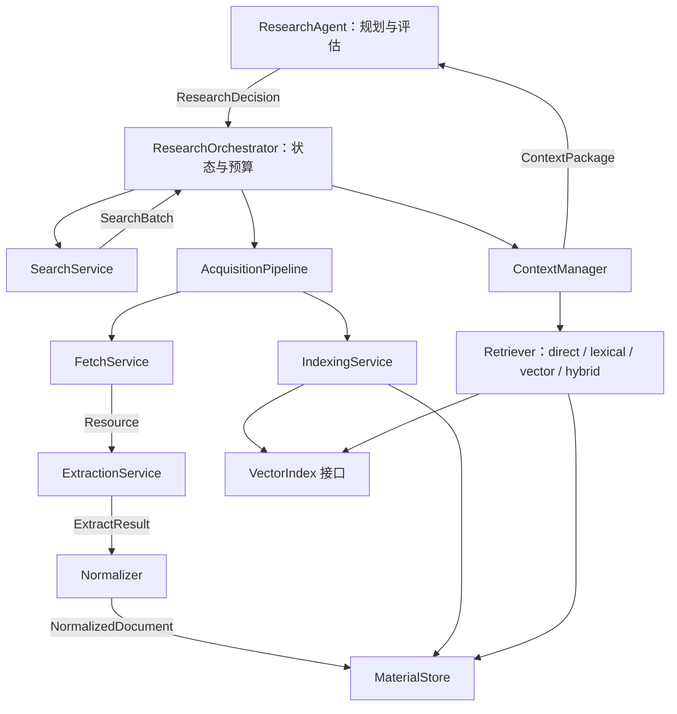

# 搜集与研究智能体实现规格 v0.1

日期：2026-09-05  
状态：可交接的实现基线；尚未实施或完成运行验证。  
依据：项目根目录的 `design_v0.1.md` 及用户在审阅中的补充要求。  
读者：负责具体实现、测试和集成的 agent / 工程师。

## 1. 目标与约束

构建可循环研究的材料采集系统：根据问题搜索资料，获取原始资源，抽取文本与结构，保存可追溯材料，组织有引用的上下文，由研究 Agent 判断证据缺口并决定继续或结束。

### 1.1 已明确的需求

- 保持模块化设计，模块职责、依赖和数据边界清晰。
- 保留 Search → Fetch → Extract → Normalize → Store 的主链路，并补齐 Index、Context 和研究循环。
- **音频、视频、OCR、多种解析后端都是 v0.1 的必需能力，不得以 MVP 简化为由删除或仅留下空接口。**
- 保留 HTML、PDF、Office、图片解析，以及页码、章节、区域和时间戳等引用定位。
- 单一 Provider 或单项材料失败，不应丢失同批次已完成的结果。
- Agent 决定研究策略；确定性代码控制执行、资源限制和持久化。

### 1.2 本规格补充的默认决策

以下为交接所需的建议默认值，不代表用户已经指定具体库、模型或部署配置：

- Python 模块化单体，网络调用使用异步接口，重计算采用受控执行器或子进程。
- SQLite 保存权威业务记录、标准文档和 Chunk；文件系统保存原始及派生大文件；Qdrant 保存可重建的向量索引。
- 首先交付可调用的 Python 接口和最小 CLI，不要求 Web UI。
- 单用户、本地或单机服务部署；Windows 为首要运行环境。必须记录实际测试的 Python、依赖和外部工具版本。
- 模型、解析库、Provider 凭据通过配置注入，禁止业务层硬编码。
- 数值限制集中配置；第 14 节给出起始配置，不构成性能承诺。

允许实现者调整内部文件拆分、库版本和部署细节，但变更公共契约、数据语义或删减必需能力，应先明确列出变更及影响。

### 1.3 范围边界

v0.1 不要求分布式调度、多租户、插件自动发现、全网持续爬取或可视化管理界面。视频能力定义为字幕、音轨转写、抽样画面文字识别及时间对齐；不承诺对无文字画面的动作、物体和场景进行完整语义理解。

网页、音视频中的内容均作为待研究材料处理，不能改变系统指令、授权、工具权限或预算。

## 2. 总体架构



图中箭头表示调用或数据流。代码依赖应遵守下表，不允许用流程图箭头推导业务层对具体数据库或解析库的依赖。

| 模块 | 负责 | 允许依赖 | 不负责 |
|---|---|---|---|
| agent | 研究计划、证据评估、最终答复 | 契约、LLM 接口 | HTTP、解析器选择、SQL、重试执行 |
| orchestration | 状态机、轮次、预算、检查点 | 各服务公共接口 | 文本解析、模型推理细节 |
| acquisition | 单项材料的获取、解析、规范化、保存、索引编排 | fetch、extraction、normalization、存储和索引接口 | 生成新研究问题 |
| search | 执行查询、来源适配、合并去重 | Provider 接口、网络运行设施 | 研究规划、正文抓取 |
| fetch | 获取字节或浏览器快照、诊断网络响应 | 资源存储接口、网络策略、HTTP / browser 实现 | 正文抽取、OCR、转写 |
| extraction | 解析文档和多模态材料 | Resource、后端接口、计算运行设施 | 外网抓取、业务数据入库、研究决策 |
| normalization | 标准化字段、结构、来源信息 | 契约、纯转换逻辑 | 网络请求、检索、建向量 |
| indexing | 切块、关键词索引、嵌入、索引状态 | 存储、Embedding、VectorIndex 接口 | 上下文格式化、研究判断 |
| context | 限定范围、召回、排序、预算、引用格式 | 存储读取、检索、TokenCounter 接口 | 创建文档、切块入库、抓取新资料 |
| storage | 持久化、查询、事务、资源引用 | 契约、数据库和文件系统 | 解析内容、生成 embedding、LLM 判断 |
| runtime | 配置、受控并发、时钟、执行器、日志 | 标准运行设施 | 业务决策 |

依赖通过构造函数或显式工厂注入，在入口统一组装。禁止导入模块时自动联网、加载大型模型或注册全局可变实例。

## 3. 建议目录

```text
src/research/
  bootstrap.py                 # 唯一组装入口
  cli.py                       # 命令入口，不放业务逻辑
  contracts/                   # 跨模块稳定模型及公共端口
    resources.py
    documents.py
    errors.py
    ports.py
  agent/
    researcher.py
    decisions.py
    prompts.py
  orchestration/
    orchestrator.py
    state.py
  acquisition/
    pipeline.py
  search/
    models.py
    service.py
    registry.py
    dedup.py
    providers/                 # searxng / arxiv / openalex / rss 等
  fetch/
    models.py
    service.py
    policy.py                  # 路由、回退条件
    security.py
    fetchers/                  # http / browser
  extraction/
    models.py
    service.py
    router.py
    policy.py                  # 解析质量、后端选择与回退策略
    extractors/                # html / pdf / office / image / audio / video
    backends/                  # 第三方库、模型适配器
  normalization/
    service.py
  indexing/
    service.py
    chunking.py
    embedding.py
  context/
    models.py
    manager.py
    budget.py
    formatter.py
    retrieval/                 # direct / lexical / vector / hybrid
    ranking.py
  storage/
    material_store.py
    resource_store.py
    sqlite.py
    qdrant.py
    migrations/
  runtime/
    config.py
    limits.py
    executors.py
    logging.py
tests/
  contracts/
  unit/
  integration/
  e2e/
  fixtures/
```

目录表达职责，不要求每项都单独建类。只在存在多个实现或独立策略时抽象接口。少量路由逻辑可以保留在 Service 内。模块内部模型留在模块内，`contracts/` 只放真正跨模块传递的类型，禁止变成通用杂物目录。

## 4. 数据契约

本节字段是语义要求，不限定必须使用 dataclass 或其他验证框架。模型必须支持持久化序列化；时间使用带时区 UTC，日期条件使用明确的日历日期语义；扩展 metadata 只允许可序列化值。

### 4.1 搜索模型

| 模型 | 必需字段与含义 |
|---|---|
| SearchQuery | `text`、`domains`、`exclude_domains`、`language?`、`start_date?`、`end_date?`、`source_types` |
| SearchRequest | `query: SearchQuery`、`provider_names`、`per_provider_limit`、`total_limit` |
| SearchOccurrence | `provider`、`query_id`、`provider_rank?`、`provider_score?`、`observed_at`、`original_url`、`channel` |
| SearchHit | `hit_id`、`url`、`dedup_key`、`title?`、`snippet?`、`published_at?`、`source_types`、`occurrences[]` |
| ProviderReport | `provider`、`status: success / failed / timeout / disabled`、`elapsed_ms`、`returned_count`、`error?`、`warnings[]` |
| SearchBatch | `hits[]`、`provider_reports[]`、`status: success / partial / failed` |

`source_types` 表示内容类别，如 web / academic / news / custom；RSS 是获取通道，在 `channel` 中表示，避免将内容类别与传输方式混为一谈。

空结果不等于失败：至少一个 Provider 成功执行时可以得到成功的空批次；部分 Provider 失败则为 partial；全部失败为 failed。原始来源分数不作为跨 Provider 的统一相关性分数。

### 4.2 资源与抓取结果

| 模型 | 必需字段与含义 |
|---|---|
| FetchRequest | `url`、`mode: auto / http / browser`、`headers`、`timeout_seconds`、`max_bytes` |
| Resource | `resource_id`、`content_hash`、`byte_length`、`media_type`、`content_ref`、`origin`、`created_at`、`parent_resource_id?`、`transform?` |
| ResourceOrigin | `requested_url?`、`final_url?`、`local_display_name?`、`acquired_at` |
| FetchResult | `resource: Resource`、`status_code`、`safe_headers`、`method: http / browser`、`elapsed_ms`、`warnings[]` |

`content_ref` 是资源存储生成的不透明引用，由 ResourceStore 提供受控读取；大型文件不能强制转为整块内存字节。`content_hash` 为保存字节的 SHA-256。

本地文件通过显式导入入口进入 ResourceStore，不伪装成 HTTP 响应，也不通过远程 Fetch 接口接受 `file://`。派生的 PDF 页面图、音轨、视频帧保存父资源与变换信息。

浏览器输出可以是渲染后 HTML 快照，应记录获取方式和抓取时间，不宣称其与原始 HTTP 响应完全相同。

### 4.3 位置与抽取结果

| 模型 | 必需字段与含义 |
|---|---|
| Locator | `page?`、`section_path[]`、`paragraph?`、`slide?`、`sheet?`、`cell_range?`、`dom_path?`、`start_ms?`、`end_ms?`、`bbox?`、`frame_ms?` |
| EvidenceBlock | `block_id`、`text`、`block_type`、`locator: Locator`、`origin_method`、`backend_id`、`backend_version`、`confidence?`、`metadata` |
| CoverageUnit | `unit_type: page / slide / sheet / time_range / document`、`locator`、`status: success / empty / partial / failed / skipped`、`reason?` |
| ExtractResult | `resource_id`、`title?`、`blocks[]`、`coverage[]`、`status: success / partial / empty`、`attempts[]`、`warnings[]`、`extraction_profile_id` |

约定：

- 页码、段落序号、幻灯片序号从 1 开始；媒体时间为从原始媒体开始计算的整数毫秒，时间区间为 `[start_ms, end_ms)`。
- `bbox` 为左上原点、相对所在页面或图像宽高归一化后的 `(x0, y0, x1, y1)`，取值在 0 到 1 之间。
- `origin_method` 至少区分 native_text、ocr、subtitle、asr；原生表格使用结构化 metadata 保留行列信息。
- 后端置信度允许为空，必须保留其来源；未经校准不得跨后端直接比较置信度。
- 页面没有文字可以是 empty；处理失败不能伪装成空白页面。损坏到无法识别的文件返回领域错误。
- `blocks` 是正文的权威表达。需要 `text` 时按确定顺序派生，避免两份内容独立修改。
- OCR、ASR 等派生文本不得覆盖原始资源；抽样视频帧的覆盖记录必须注明抽样范围与间隔。

### 4.4 标准文档、切块和引用

| 模型 | 必需字段与含义 |
|---|---|
| DocumentIdentity | `document_id`、`source_key`、`aliases[]` |
| NormalizationInput | `result: ExtractResult`、`resource: Resource`、`identity: DocumentIdentity`、`revision_id`、`provenance: SearchOccurrence[]`、`published_at?`、`language?` |
| NormalizedDocument | `document_id`、`revision_id`、`artifact_id`、`resource_id`、`title?`、`published_at?`、`language?`、`blocks[]`、`coverage[]`、`attempts[]`、`warnings[]`、`provenance[]`、`extraction_profile_id`、`normalizer_version`、`status: success / partial / empty` |
| Chunk | `chunk_id`、`artifact_id`、`document_id`、`revision_id`、`text`、`block_spans[]`、`locators[]`、`chunk_profile_id`、`ordinal` |
| BlockSpan | `block_id`、`char_start`、`char_end`，采用 Unicode 字符偏移的半开区间 |
| RetrievalHit | `chunk: Chunk`、`rank`、`score?`、`retrieval_method` |
| Citation | `citation_id`、`chunk_id`、`artifact_id`、`document_id`、`revision_id`、`source_url?`、`resource_id`、`locators[]`、`block_spans[]` |

身份语义：

1. `source_key` 是保守规范化后的来源身份。`document_id` 首次建立后稳定保存；本地导入使用显式来源标识，缺省可用文件内容哈希。
2. 同一来源的不同原始内容对应不同 `revision_id`；同来源同哈希重试复用同一 revision。
3. `artifact_id` 唯一对应 revision、完整抽取配置及其版本、规范化版本、输出清单哈希。输出清单包含有序块、位置和 coverage，不包含运行耗时等易变诊断；相同输出重试可复用，更换模型或补全失败页后产生新产物，不能原地改写已引用产物。
4. `chunk_id` 在 artifact、切块配置版本、位置和内容相同的情况下稳定；重新切块不会悄悄替换旧引用。
5. 不同来源即使内容相同，也保留各自文档和 provenance；底层资源字节可以按哈希复用。
6. Search 去重、资源哈希去重、上下文近似去重是三个不同操作，不共用一个身份规则。

profile ID 应由规范化配置及实际后端/模型版本确定，不能仅使用可被任意修改含义的名称。部分解析恢复成功后保存新 artifact，并在当前任务中接纳新产物；旧 ContextPackage 仍引用原快照。运行尝试诊断单独追加保存，不通过修改正文身份来记录耗时。

### 4.5 任务与上下文

| 模型 | 必需字段与含义 |
|---|---|
| ContextFilter | `document_ids?`、`domains?`、`source_types?`、`language?`、`start_date?`、`end_date?`、`include_unknown_dates=false` |
| MaterialScope | `scope_id`、`task_id`、`artifact_ids[]`、`created_at`；是一次上下文构建中固定的材料集合 |
| ContextRequest | `task_id`、`query`、`filters`、`max_tokens` |
| ContextPackage | `task_id`、`query`、`scope_id`、`selected_chunks[]`、`citations[]`、`formatted_text`、`token_count`、`warnings[]`、`coverage_summary` |
| ResearchTask | `task_id`、`question`、`status`、`round`、`budget_used`、`checkpoint`、`created_at`、`updated_at` |
| ResearchDecision | `action: search / finish`、`queries: SearchQuery[]`、`source_types`、`evidence_gaps[]`、`reason`、`draft_answer?`、`citation_ids[]` |
| ResearchResult | `task_id`、`status: completed / partial / failed / cancelled`、`answer`、`citations[]`、`limitations[]`、`stop_reason`、`usage` |

任务通过关联记录引用确定的 artifact；不能因另一个任务更新了同 URL 而自动读取新版本。默认选择该任务中每个 document 最近成功接纳的 artifact，并在创建 scope 时固定。部分成功文档可以接纳，但须带覆盖缺失信息。

### 4.6 错误契约

公共服务在整项操作不能产出有效结果时抛出 `DomainError`，至少包含 `code`、`stage`、`message`、`retryable`、`retry_after_seconds?`、`item_id?`、`safe_details`。

错误码至少覆盖：INVALID_REQUEST、UNSUPPORTED_FILTER、PROVIDER_UNAVAILABLE、UNSAFE_URL、HTTP_ERROR、BLOCKED、TIMEOUT、TOO_LARGE、NETWORK_ERROR、UNSUPPORTED_MEDIA、BACKEND_UNAVAILABLE、EXTRACTION_FAILED、RESOURCE_LIMIT、INDEX_FAILED、BUDGET_EXHAUSTED、INVALID_DECISION。

批处理边界将单项 DomainError 转为报告，保留成功项；取消信号必须向上传播，不能转换为可重试普通失败。未知异常记录诊断并使所属工作项失败，不能被吞掉后返回 success。

## 5. 公共接口

下表为语义签名，不是待复制的完整 Python 实现。`async` 表示调用方可等待，不代表内部重计算可以直接运行在事件循环中。

| 接口 | 签名 | 结果与约束 |
|---|---|---|
| SearchProvider | `async search(query: SearchQuery, limit: int) -> list[SearchHit]` | 单一来源；能力检查和查询适配在 Provider 内 |
| SearchService | `async search(request: SearchRequest) -> SearchBatch` | 多来源报告、合并、总量限制 |
| FetchService | `async fetch(request: FetchRequest) -> FetchResult` | 获取有效资源或抛 DomainError |
| ResourceStore | `async import_file(path) -> Resource`；`open(resource_id)` | path 经导入根目录校验；open 返回受控可关闭的流或文件访问句柄 |
| ExtractionService | `async extract(resource: Resource, profile_id: str) -> ExtractResult` | 不直接发起来源 URL 请求 |
| Extractor | `async extract(resource: Resource, profile_id: str) -> ExtractResult` | 某类材料的解析工作流 |
| Normalizer | `normalize(input: NormalizationInput) -> NormalizedDocument` | 所有处理上下文显式输入，纯转换 |
| MaterialStore | `resolve_identity(source_key) -> DocumentIdentity`；`resolve_revision(document_id, resource_id) -> str` | 以事务和唯一约束解决重复处理 |
| MaterialStore | `save_document(task_id, document) -> artifact_id`；`resolve_scope(task_id, filters) -> MaterialScope` | 保存后建立任务关联；scope 查询必须先约束 task_id |
| MaterialStore | `get_document(artifact_id)`；`save_chunks(artifact_id, chunks)`；`read_chunks(scope)` | 持久化接口，不生成 embedding |
| IndexingService | `async index(artifact_id: str) -> IndexReport` | 幂等切块及索引；IndexReport 含 lexical/vector 各自状态与错误 |
| Retriever | `async retrieve(query: str, scope: MaterialScope, top_k: int) -> list[RetrievalHit]` | 必须先在 scope 内召回 |
| ContextManager | `async build(request: ContextRequest) -> ContextPackage` | 最终文本满足输入预算 |
| ResearchAgent | `async decide(task: ResearchTask, context: ContextPackage) -> ResearchDecision` | 首轮 context 可以为空内容包 |
| ResearchOrchestrator | `async run(question: str) -> ResearchResult`；`async resume(task_id: str) -> ResearchResult` | 驱动状态和恢复，不直接处理第三方实现 |

AcquisitionPipeline 的输入为任务 ID、SearchHit 或已导入 Resource，以及抽取配置；输出 AcquisitionReport，包含工作项 ID、artifact_id（如有）、fetch/extract/store/index 各阶段状态和错误。

其余公共端口的语义签名如下。所有 ID 使用字符串；向量为浮点数组，禁止以第三方 SDK 类型跨越边界。

| 端口 | 语义签名与类型 |
|---|---|
| LLMClient | `async generate_decision(task, context, remaining_output_tokens: int) -> DecisionResponse`；DecisionResponse 含 ResearchDecision、model_id、input_tokens、output_tokens；内部负责将契约序列化到模型接口 |
| EmbeddingClient | `async embed(texts: list[str], profile_id: str) -> EmbeddingBatch`；EmbeddingBatch 含 profile_id、dimension、vectors，向量数量和输入顺序一致 |
| TokenCounter | `count(text: str) -> int`；实例绑定明确 model_id 与 tokenizer_version |
| VectorIndex | `async upsert(points: list[VectorPoint], profile_id: str)`；`async search(vector, scope: MaterialScope, profile_id: str, top_k: int) -> list[VectorMatch]`；`async delete(point_ids: list[str], profile_id: str)` |
| VectorPoint / VectorMatch | VectorPoint 含 point_id、chunk_id、artifact_id、vector、payload；VectorMatch 含 point_id、chunk_id、artifact_id、score |
| BackendRegistry | `list_capabilities() -> list[BackendDescriptor]`；`get(backend_id: str) -> Backend`；Backend 的输入输出见第 8.2 节 |

上述存储接口如采用同步实现，需由受控执行器承载阻塞调用，事务内不得跨线程共享未明确支持的连接。允许整体采用异步存储接口，但必须统一更新契约及调用方，不能混用隐含 await 约定。

## 6. Search 行为

### 6.1 Provider 与查询

- 首批实现 SearXNG、arXiv、OpenAlex、RSS 的适配与契约测试；RSS 在显式配置的订阅集合中获取条目并执行本地条件匹配，不宣称全网搜索。
- 原设计中的 Bing 保留扩展位置；实现者接入前核验当时实际可用的官方服务、权限与接口。未配置或不可用时报告 disabled/unavailable，不提供伪成功实现。
- `per_provider_limit` 控制单来源获取上限，`total_limit` 控制合并返回上限；两者都必须为正整数。
- Provider 支持的日期、语言、域名等能力必须可查询。能可靠后过滤的条件可以后过滤并报告；不能保证满足时返回 UNSUPPORTED_FILTER，不静默忽略。
- 日期筛选作用于发布时间；指定日期范围时，未知日期默认排除。日期区间按 UTC 日历日闭区间解释，并转换为明确的起止时间。
- Provider 特有参数进入对应配置对象，公共方法不使用无约束 `**kwargs` 传递隐含语义。

### 6.2 并发、融合与去重

- 每个 Provider 独立超时；整批有截止时间。截止时取消未完成调用，返回已完成结果和超时报告。
- 默认采用与第 10.2 节相同的 RRF 公式融合 Provider 内排名，记录算法版本；同来源重复命中只贡献一次排名，不直接相加不同来源的原始 score。
- 去重仅合并候选项，合并后保留所有 occurrences。标题、日期冲突采用确定优先级并保存原始值，不能无痕覆盖。
- URL 保留原始值；dedup_key 仅做保守规范化，如 scheme/host 大小写、协议定义的默认端口。不得无条件合并 HTTP/HTTPS、路径大小写或尾部斜杠。
- 跟踪参数删除采用可配置白名单；原 URL 始终保留。fragment 可从普通 HTTP 资源获取键中排除，但保留为引用定位；对 hash 路由页面不能据此认定浏览器内容相同。
- Registry 使用入口显式注册，重复名称报配置错误；导入 Provider 文件不能产生注册之外的外部副作用。

## 7. Fetch 与资源管理

### 7.1 路由和回退

- auto 模式先 HTTP；明确需要 JavaScript 渲染时允许一次 browser 回退。browser 模式也必须遵守同一网络策略。
- 明确 CAPTCHA、访问拒绝、需登录或挑战无法完成时返回 BLOCKED，不无限重试。检测不能只靠正文中出现一个关键词，应结合响应、页面结构和正文质量，并记录诊断理由。
- 网络错误与 HTTP 响应错误分开记录。没有响应的失败不能伪造 `status_code=200` 或空成功资源。
- MIME 结合响应类型和文件签名确定；发生冲突记录告警，以安全且能解释的路由规则处理。未知类型返回 UNSUPPORTED_MEDIA。
- FileDownloader / MediaDownloader 若只是 HTTP 流式保存，不另造平行网络栈；复用 HTTPFetcher。分段媒体处理可作为下载策略，但下载的每个地址都必须经过网络策略。

### 7.2 限制与安全

- 默认只允许 HTTP/HTTPS；拒绝回环、私有、链路本地、未指定等非公网目标，覆盖 IPv4、IPv6 及映射地址。
- DNS 解析结果、实际连接目标、每次重定向均受校验；避免校验与连接使用不同解析结果。
- 浏览器子资源、WebSocket 和下载请求也受出口限制。若浏览器内拦截无法保证覆盖，使用受控代理或隔离网络；不能声称仅检查首页 URL 就完成 SSRF 防护。
- 全局与每主机并发限制同时生效；下载按流累计字节，不能仅信任 Content-Length。压缩内容还需限制解压后大小。
- 浏览器完成、失败或取消后关闭页面与上下文。跨域重定向不携带不应转发的认证信息；日志不保存 Cookie、Authorization、API Key。
- 本地导入必须显式指定允许目录，校验解析后的实际路径，不能让资料内容指定任意本地读取路径。

### 7.3 生命周期

原始资源保存到任务配置的数据目录；工作临时文件存储在任务专属目录。数据库提交前保证引用文件已经完成写入。取消时清理未提交临时文件；已提交且被引用的资源保留。原始文件供解析、重建索引和引用复查使用，不能任务结束即删除。

## 8. 多模态 Extraction

### 8.1 层次与后端

ExtractionRouter 根据资源媒体类型选择 Extractor。Extractor 组织某类材料的步骤，Backend 只封装具体技术能力。视频 Extractor 可以通过注入的音频/OCR 能力组合流程，但不能反向调用 ExtractionService 造成循环依赖。

| 能力 | 候选后端 | 统一输出 |
|---|---|---|
| HTML 正文及结构 | Trafilatura、BeautifulSoup 适配实现 | 有顺序和章节位置的 EvidenceBlock |
| PDF 原生文本与页面结构 | PyMuPDF、Docling 适配实现 | 带页码与区域的 EvidenceBlock |
| Office 文档结构 | Docling 或按格式配置的专用库 | 章节、幻灯片、工作表和表格块 |
| 图片与扫描页 OCR | PaddleOCR 适配实现 | 文本、区域、后端置信度 |
| 音频识别 | Whisper 家族的实际可运行实现 | 带时间区间的转写块 |
| 媒体探测、音轨、字幕和帧提取 | FFmpeg / FFprobe 适配实现 | 派生 Resource、时长、轨道和变换信息 |

这些是候选技术映射，不是对某版本兼容性、许可证、语言支持或格式完整性的承诺。实现者必须核验官方文档、选定实际版本并提供锁定配置；公共契约不得暴露第三方专有返回类型。

最低交付要求：

- HTML 至少两个真实可切换后端；PDF 至少两个真实可切换的文本/结构解析后端。
- 图片 OCR、音频 ASR、视频媒体处理各至少一个真实后端。所有声明支持的 Office 格式都有真实解析实现。
- 可通过配置指定首选后端、备用后端及禁用项；注册第二个后端后无需修改调用 ExtractionService 的代码。
- 不要求每一种格式都绑定所有后端。未启用的重型依赖延迟加载；核心包可以在缺少某后端时导入。
- 对已启用且必需的能力，缺依赖、缺模型或初始化失败必须通过 preflight 检查明确报告，不能成功启动后把全部输入变成空文本。

### 8.2 后端公共契约

BackendDescriptor 包含 `backend_id`、`version`、`capabilities[]`、`supported_media_types[]`、`availability`、`unavailable_reason?`。BackendRequest 包含 `resource_id`、`capability`、`locator?`、`profile_id`、`remaining_seconds`。BackendOutput 包含 `blocks[]`、`derived_resources[]`、`coverage[]`、`metrics`、`warnings[]`。

统一语义接口为 `async run(request: BackendRequest) -> BackendOutput`，由每种能力的适配器验证请求；对不同能力的专有配置使用有类型的 profile，不能以任意 metadata 代替必需参数。

BackendAttempt 记录后端 ID/版本、能力、目标页或时间范围、开始和结束时间、状态、失败原因、回退触发原因。所有时间开销都扣除同一个工作项总预算。

### 8.3 HTML

- 去除导航、脚本、样式和明显重复模板，保留标题层次、段落、列表和表格。
- 主后端返回无正文、结构无效或达到配置的质量回退条件时，调用备用后端一次；仅字符少不能证明错误，短公告可以有效。
- 同一页面不同后端的输出以选择较佳完整产物为默认策略，不直接拼接两份全文制造重复。

### 8.4 PDF 与 OCR

- 支持文本型、扫描型及混合型 PDF。按页评估原生文本质量，不因一页有文本而跳过整份文档的 OCR。
- 有有效原生文本的页优先使用原生文本；无文本但含图像的页、无效字符或异常读取顺序的页进入 OCR / 后端回退策略。
- 可配置混合页的图像区域 OCR；同区域的原生文本与 OCR 候选按来源和重叠规则择优，不重复加入正文。
- 扫描页 OCR 必须保留页码和坐标。表格保留行列、表头和单元格值；无法可靠恢复结构时输出文本并明确告警，不伪造表格结构。
- 某页失败不丢弃其他页，返回 partial 和完整 CoverageUnit。密码保护、损坏等不可处理原因必须区分。

### 8.5 Office 与图片

- 必须支持 DOCX、PPTX、XLSX；旧二进制 DOC/PPT/XLS 不在默认保证中，不支持时明确返回 UNSUPPORTED_MEDIA。
- DOCX 保留标题路径、段落和表格；PPTX 保留幻灯片序号及文本，图片中的文字走 OCR。
- XLSX 保留工作表、单元格范围、表头和表格内容。仅有公式而没有可用缓存值时，保留公式并说明未计算，禁止编造计算结果。
- 图片至少支持 PNG、JPEG；OCR 保留区域位置。对旋转、方向校正等变换，坐标应映射回原资源，或完整保存可逆变换信息。
- Office 内容中的嵌入图片按 profile 开启 OCR，提取文本仍须关联原段落、幻灯片或工作表。

### 8.6 音频

- 至少支持 WAV、MP3；使用媒体后端探测并转换为 ASR 输入，保留与原音频的时间映射。
- 转写按可控时间段执行，保留起止时间；长音频按段处理，失败段可单独重试。
- 静音段允许 empty；无语音不能输出模型猜测的正文。应记录所用的静音/无语音判定策略。
- 默认语言自动检测，可配置显式语言。说话人分离不属于默认保证；未实现时不伪造说话人标签。

### 8.7 视频

- 至少支持 MP4、WebM 的配置可解码输入；实际编解码支持由 preflight 与格式测试清单报告。
- 探测音轨、字幕轨、时长；文本字幕保留语言和时间戳，图像字幕可经 OCR 处理。
- 默认优先使用选定语言的有效字幕；无字幕或存在明确覆盖缺口时执行音轨 ASR。profile 可以指定 always_asr；不同来源冲突时保留差异记录，不无标记合并。
- 默认按固定间隔抽帧 OCR，可配置场景变化补充抽帧。每帧记录原视频时间和文字区域；上限触发时在 coverage 中标明采样不足。
- 字幕、ASR、画面 OCR 是独立证据来源，按时间排序关联。相邻帧的重复文字可合并时间覆盖，但来源和原帧引用必须可追溯。
- 无音轨不妨碍画面 OCR；无字幕不妨碍 ASR；某一路失败且另一路产出有效结果时返回 partial。
- 不将抽帧 OCR 描述为逐帧完整识别，也不将音轨转写描述为完整视频理解。

### 8.8 质量与执行隔离

- 基础质量指标包括可用文本量、异常字符比例、页面/时间覆盖、结构完整性和重复率；后端分数仅作为该后端范围内的辅助信息。
- 回退条件和阈值存入有版本的 profile；固定输入与配置应得到可解释的后端选择，不能由未记录的 LLM 判断切换。
- CPU / GPU 密集型解析不得堵塞网络事件循环；不可中断的解析器通过可终止的子进程或受控工作进程执行，单纯等待超时不等于工作已停止。
- 媒体子进程使用参数列表，禁止将文件名拼入 shell 命令；退出、超时和取消均回收子进程与句柄。
- 对 Office 压缩包、页面渲染、媒体解码配置解压大小、页面数、像素数、时长和临时磁盘上限。
- 多模态模型允许 CPU 配置与 GPU 配置差异，必须报告已测试设备与限制。默认不自动下载模型；下载由配置或安装步骤显式启用。

## 9. Normalize、Storage 与版本恢复

### 9.1 Normalize

Normalizer 接收抽取结果及明确的资源、身份、revision、来源上下文，统一字段、Unicode、段落空白、位置和元数据。不能在此总结、改写证据或根据研究问题删掉“不相关”内容。

Search 中的 URL / 结果字段规范化属于搜索内部转换；此处的 Normalize 负责标准文档，两者不要合并成一个全局 normalize 工具模块。

### 9.2 最低存储实体

| 实体 | 关键字段或唯一性 |
|---|---|
| resources | resource_id、hash、content_ref、size、media_type；hash 可共享底层文件 |
| documents | document_id、source_key 唯一 |
| revisions | revision_id；document_id + 原始内容 hash 唯一 |
| artifacts | artifact_id；revision + extraction_profile + normalizer_version + 输出清单哈希唯一，保存 coverage 和诊断引用 |
| provenance | artifact/document 与 SearchOccurrence、原始 URL 的关联 |
| blocks | artifact_id + block_id；正文、locator、后端来源 |
| chunks | chunk_id；artifact + chunk_profile + ordinal 唯一 |
| task_materials | task_id + artifact_id 唯一，保留加入顺序和接纳状态 |
| index_jobs | artifact_id + index_profile_id 唯一；lexical/vector 各自状态与错误 |
| tasks / work_items | 研究状态、轮次、工作项阶段、预算、尝试次数、检查点 |

数据库使用迁移管理，必须设置外键和必要唯一约束。事务封装在存储实现中；业务模块不得拼接 SQL 或操作 Qdrant 客户端。

### 9.3 写入与恢复顺序

1. 完成原始资源写入，解析并生成标准文档。
2. 在 SQLite 事务中保存文档、块、来源、任务关联和待索引记录。
3. IndexingService 按版本化策略生成 Chunk，在事务中保存 Chunk 与关键词索引状态。
4. 生成 embedding，按稳定向量 ID upsert；全部批次确认成功后将对应向量索引标记 ready。
5. 中途失败保留已提交材料，记录失败阶段；恢复时从未完成阶段继续。

SQLite 是业务权威来源。Qdrant 写入成功但 SQLite 标记前崩溃时，重复 upsert 应安全；SQLite 成功但 Qdrant 失败时，关键词检索和直接读取仍可工作。查询向量结果后还必须校验其 artifact 属于 scope 且相关索引任务 ready。

原始内容未变但解析配置变化应生成新 artifact；旧引用继续指向旧 artifact。删除任务默认只解除任务关联；资源垃圾回收仅删除没有引用的对象，采用单独显式维护操作。

## 10. Indexing 与检索

### 10.1 切块

- 结构优先：HTML/DOCX 按章节和段落，PDF 按页与段落，PPTX 按幻灯片，XLSX 按表格区域，音视频按时间段。
- 默认目标 600 tokens、硬上限 900 tokens、重叠最多 80 tokens，可配置。不得为达到目标长度跨文档拼接；跨页合并须保留每段位置。
- 表格切分按行组保留表头；超大行需要进一步切分并记录范围。纯标题可以附着下一块，但不能丢失原文位置。
- Chunk 保存对标准块的精确跨度；重叠只影响检索，不修改原文。对超长块切分后仍可还原引用。
- 语义切块作为可选有版本策略保留；默认结构切块必须独立可用，不强制依赖 LLM。

### 10.2 关键词与向量

- 实现 direct、lexical、vector、hybrid 四条路径；Qdrant 的接入是本版交付项，不以只写接口代替。
- 中文资料是明确使用场景，关键词索引必须有经测试的中文分词或 n-gram 策略；不能只使用空格切分并以英文样本证明中文检索完成。
- embedding profile 记录模型 ID、版本、维度和预处理版本；不同模型/维度使用独立 collection 或明确命名空间，禁止混合检索。
- 向量 point ID 必须从 chunk_id 与 embedding profile 确定性生成，并符合后端实际 ID 格式；payload 至少带 artifact_id、document_id、revision_id、chunk_id。
- Hybrid 默认采用 RRF，`score = Σ 1/(60 + rank)`，rank 从 1 开始；各路 top_k 默认 30，融合后最多 30 个候选。参数可配置且写入诊断。
- 默认使用融合排名及规则去重，不强制交叉编码器；如配置 reranker，失败时退回融合顺序并记录 warning。
- 向量索引不可用时降级 lexical；必须显式报告降级，不能对外声称使用了 hybrid。未完成索引的可用文档仍可在小范围 direct 路径中使用。

### 10.3 范围一致性

所有检索都接收 MaterialScope。关键词与向量检索必须在允许的 artifact 集合内取 Top K，不能先对全库取 Top K 再过滤代替范围召回。向量路径先取 scope 与当前 embedding profile 已 ready 产物的交集，再执行召回，返回后再次校验。向量后端范围过大时可分批查询并合并，但不得扩大范围。

筛选日期默认采用标准文档发布时间；未知日期规则与 Search 一致。检索结束到构建引用期间保留同一 scope，不重新解析“最新版本”。

## 11. Context 构建

执行顺序：

1. 用 task_id 与 filters 生成固定 MaterialScope。
2. 先读取轻量元数据和 token 估计，避免为判断阈值把整个资料库载入内存。
3. 范围内全部可用材料格式化后能满足预算时，使用 direct 路径，按稳定顺序组织。
4. 否则在同一 scope 内召回、融合、相关性排序、近似去重和来源多样性选择。
5. 生成引用标记及来源说明，再按最终格式化文本计数并执行预算裁剪。
6. 返回 ContextPackage，包括空范围、索引降级、材料覆盖缺失和省略内容的说明。

`ContextRequest.max_tokens` **仅表示本次证据包可使用的输入 token 数**。调用者先从模型上下文上限扣除系统提示、任务提示、历史消息和预留输出，再将剩余证据预算传入。

TokenCounter 必须与目标模型的实际 tokenizer 匹配，返回的 token_count 包含引用、标题与分隔符。未配置可验证的计数器时，不得声称严格预算保证；运行前检查应报告配置错误。

裁剪优先移除低排名完整 Chunk。一个 Chunk 超预算时，可以按已有块/句边界截断，但同步缩小 BlockSpan 和引用范围。不能截断一个引用标记，不能把未展示原文仍算入该引用覆盖范围。

来源多样性采用软约束：当其他来源有相关候选时减少单一文档/域名重复占用；只存在一个有效来源时不为凑多样性丢弃证据。相同内容的转载可合并展示并保留来源关系。

Formatter 输出稳定的引用 ID，例如 `[C1]`，并提供到 Citation 的映射。模型生成的引用 ID 必须存在于提供的映射中；引用存在性检查不等于已经证明答案每个判断都被原文支持。

## 12. Agent 与 Orchestrator

### 12.1 职责

Agent 通过 LLMClient 生成结构化 ResearchDecision。首次以问题和空内容包生成查询；后续结合上下文评估证据缺口、矛盾及是否结束。SearchService 不调用 LLM 生成研究问题。

Orchestrator 验证决策字段、查询数量、所选来源和预算；决定何时执行服务与持久化。Agent 不能提高自身预算、关闭网络策略或访问数据库实现。

### 12.2 状态

```text
PLAN → SEARCH → ACQUIRE → INDEX → BUILD_CONTEXT → EVALUATE
  ↑                                                 │
  └──────────────── CONTINUE ────────────────────────┤
                                        FINISH → DONE
```

ACQUIRE 内每项工作按 FETCH → EXTRACT → NORMALIZE → STORE 推进。AcquisitionPipeline 支持 `index_after_store=false` 的编排配置，让 Orchestrator 在 INDEX 阶段统一调用 IndexingService；独立导入入口可设置为 true。两条入口复用相同逻辑，不重复索引。

- 工作项各自保存阶段状态，不能只保存一个批次状态后在恢复时重新下载整批材料。
- EVALUATE 对当前上下文调用 Agent。continue 时保存其新查询计划，再进入下一轮；不得在 PLAN 中无条件再调用模型覆盖刚生成的计划。
- PLAN/EVALUATE 的结构化输出无效时最多做一次格式修复调用，计入模型预算；再次失败返回 INVALID_DECISION 并保留材料。
- 一轮没有新接纳的内容版本不等同于失败；连续达到无增量轮数上限时停止，返回 partial 与证据缺口。
- 有明确预算、用户取消、无可用来源、不可恢复配置错误时可从任一阶段退出。

### 12.3 停止与恢复

停止原因至少包括：evidence_sufficient、max_rounds、deadline、llm_budget、material_budget、no_progress、cancelled、fatal_error。

默认预算用尽而仍有材料时返回 partial；没有任何可用材料且无法继续时返回 failed。只有流程正常完成且 Agent 判定可结束时返回 completed；completed 不表示结论已被外部验证。

`action=search` 必须有非空 queries；`action=finish` 必须有 draft_answer，queries 必须为空。预算耗尽时禁止为了生成结束语再超预算调用 LLM；可返回最近可用草稿，或确定性生成的证据摘录与未完成说明，明确标为 partial。

检查点保存 task_id、轮次、当前计划、各工作项状态、累计预算、已接纳 artifact 和必要引用映射。resume 不重置预算或覆盖原任务的截止时间；需要延长预算时通过显式配置变更记录。重复调用 resume 必须防止两个执行者同时处理同一任务，单机可用任务锁。

最终 ResearchResult 包括回答、可解析引用、遗漏和覆盖限制、停止原因及实际使用量。模型输出中不存在的引用 ID 必须被拒绝或修复；修复仍失败时返回部分结果和明确诊断。

## 13. 重试、可观测性与配置

### 13.1 重试归属

- SearchService 负责 Provider 的临时网络错误重试；FetchService 负责抓取重试；ExtractionService 负责解析单位重试与后端回退；IndexingService 负责索引批次重试。
- Orchestrator 只恢复已记录的未完成工作项，不在服务重试外再无界包一层重试。
- 只对明确可重试错误重试；UNSAFE_URL、UNSUPPORTED_MEDIA、缺凭据等永久错误不得反复尝试。
- 对 429/临时网络错误遵守合理的 Retry-After 和带抖动退避，但不能超过剩余总截止时间。
- 重试次数、后端回退、恢复后的尝试次数均持久化，重启不获得新的无限尝试机会。

### 13.2 观测

结构化事件至少包含 task_id、work_item_id、stage、provider/backend、artifact_id（如有）、attempt、elapsed_ms、status 和 error_code。记录阶段耗时、字节数、成功/失败/部分成功数、索引滞后、输入输出 tokens 及降级次数。

普通日志不输出完整正文、认证数据和带秘密参数的 URL。提供任务状态查询及工作项错误摘要，不要求接入外部监控平台。

### 13.3 配置

配置应分为 providers、fetch、extraction profiles、backends、storage、indexing、context、research budgets、runtime limits。启动时验证必需依赖、目录、数据库、模型与后端可用性；可选能力不可用时输出清单，不隐藏。

完整验收配置启用所有必需能力。低资源运行配置可以显式禁用某些后端，但不能以该配置冒充完整版本的交付。

## 14. 建议起始限制

以下是可覆盖的起始配置。实现者需根据实测资源调整并记录理由；不得在多个模块散落重复常量。

| 配置 | 起始值 |
|---|---|
| 单 Provider 超时 / 整轮搜索截止 | 20 秒 / 45 秒 |
| Provider / HTTP 最大尝试次数 | 2 次，包含首次 |
| 索引单批次最大尝试次数 | 3 次，包含首次，恢复不重置累计次数 |
| HTTP 单次超时 / browser 超时 | 30 秒 / 60 秒 |
| 单项抓取总时间（含重试和回退） | 120 秒 |
| 全局下载并发 / 每主机并发 | 8 / 2 |
| 每主机请求速率 | 每秒 2 次，初始突发上限 2 |
| 浏览器并发 | 2 |
| CPU 重解析并发 / GPU 工作并发 | 2 / 1 |
| 同一解析单位最大后端尝试次数 | 2 次，包含首选与备用；不再叠加隐藏重试 |
| 单页 OCR / 单音频段处理截止 | 120 秒 / 180 秒 |
| 普通资源 / 显式媒体下载大小上限 | 50 MiB / 1 GiB |
| 单资源解析总截止 / 临时磁盘上限 | 30 分钟 / 5 GiB |
| Office 解压后大小上限 | 500 MiB |
| 单图片或页面渲染像素上限 | 25 百万像素 |
| PDF 页面上限 / 音视频时长上限 | 500 页 / 60 分钟 |
| ASR 分段目标长度 | 30 秒，重叠与时间映射由 profile 明确记录 |
| 视频抽帧间隔 / 单视频帧数上限 | 5 秒 / 720 帧 |
| 单轮查询数 / 每 Provider 结果 / 合并结果 | 3 / 10 / 每条查询 20 |
| 单轮新采集资源 / 单任务新采集资源上限 | 20 / 60 |
| 最大轮数 / 连续无新增轮数 | 3 / 2 |
| 单任务总截止 / LLM 调用上限 | 60 分钟 / 10 次，含修复调用 |
| 单任务 LLM 输入输出累计预算 | 100,000 tokens，计入所有模型调用 |
| Context 证据包默认预算 | 8,000 tokens，且不得超过调用者的剩余上下文空间 |

资源类型不明时先采用普通资源上限；媒体较大上限仅在请求明确允许媒体且类型验证通过后启用。阶段超时取自身配置与任务剩余时间的较小值。下载次数、转码/解析资源和模型预算在调度前预留，执行后结算，避免并发任务分别通过检查后合计超限。

运行环境无法满足某输入的资源需求时返回 RESOURCE_LIMIT 或 partial，并说明哪个限制生效；不能通过静默省略后半段内容返回完整成功。

## 15. 验收标准

验收分为离线确定性测试和真实后端集成测试。契约测试可用 fake；多模态必需能力必须提供真实样本与实际执行结果，不能只提交 mock 通过记录。

| ID | 场景 | 通过条件 |
|---|---|---|
| A01 | 新增搜索 Provider | 仅新增适配器、注册配置及相关测试；Fetch、Context、Agent 不改动 |
| A02 | 一个 Provider 超时、另一个成功 | 按批次截止返回成功结果与超时报告，未完成调用被取消 |
| A03 | Provider 不支持日期或域名条件 | 可靠后过滤并报告，或明确 UNSUPPORTED_FILTER；结果不假装满足条件 |
| A04 | 同页面被两个 Provider 命中 | 合并为一个候选，保留两个 occurrences；不混加来源 score |
| A05 | `/a`、`/a/`、不同协议和 hash 路由 | 保守去重；原 URL 与定位信息可追溯，不错误合并不同页面 |
| A06 | DNS、重定向、浏览器子资源指向私网 | 所有路径均被网络策略拦截；测试使用受控网络替身，不探测真实私网 |
| A07 | JS 页面、验证码页面、大流式响应 | JS 可回退一次；明确受阻页停止；超大小在读取中中止 |
| A08 | HTML 正文及备用后端 | 两个真实后端均可配置运行，回退有理由且正文不重复拼接 |
| A09 | 文本型、扫描型、混合型 PDF | 原生文本与 OCR 分页处理；页码/区域正确；混合内容不重复 |
| A10 | PDF 中一页损坏或 OCR 超时 | 其他页结果保留，status=partial，失败页可定位和重试 |
| A11 | 更换 PDF 后端 | 上游 Fetch、下游 Context 和 Agent 不改动；生成不同 artifact 配置版本 |
| A12 | PNG/JPEG、DOCX、PPTX、XLSX | 均有真实样本；图片 OCR、章节/幻灯片/单元格位置正确；公式不伪造值 |
| A13 | 中英文短音频、静音、失败分段 | 有真实转写与时间戳；静音不编造正文；失败段不影响其余段 |
| A14 | 有字幕、无字幕、无音轨视频 | 分别验证字幕、ASR、画面 OCR 路径及来源标签；缺失通道有明确状态 |
| A15 | 视频中重复画面文字与失败通道 | 时间对齐及去重可追溯；抽样 coverage 明确；部分有效内容得以保留 |
| A16 | 多模态工作项超时或取消 | 子进程/浏览器/文件句柄回收，网络任务仍能响应，无无限后台计算 |
| A17 | 相同内容重试、同 URL 更新、换解析配置 | 分别复用 revision、新建 revision、新建 artifact；无重复任务关联 |
| A18 | SQLite 提交后 Qdrant 失败，再恢复 | 原材料可读取；lexical 可用；重复 upsert 无重复向量；最终状态 ready |
| A19 | 向量已写入、状态未提交时模拟崩溃 | 未 ready 数据不作为可用索引；恢复可安全补完并校验 |
| A20 | 两个任务含不同材料，并设置日期/来源过滤 | direct、lexical、vector、hybrid 都严格使用同一允许范围，无跨任务材料 |
| A21 | 中文行业查询与英文查询 | 关键词和向量各有固定正例；结果及融合顺序可解释，不只测试英文分词 |
| A22 | 极小 token 预算、超长块、表格 | 最终格式化文本不超预算；引用与实际展示范围一致；无法容纳时明确说明 |
| A23 | 固定数据重建索引并复查引用 | 稳定 chunk/profile 身份可复现；每个 Citation 可回到对应版本和原始位置 |
| A24 | Agent 反复继续、输出无效结构、虚构引用 | 代码强制预算；格式修复有次数上限；无效引用不能当成功引用输出 |
| A25 | 已处理工作项后任务中断、resume | 从持久检查点继续，不重置预算、不重复下载已完成项、不重复写入 |
| A26 | 向量后端不可用、必需解析模型缺失 | 前者显式 lexical 降级；后者 preflight 或工作项报错，不能空结果伪成功 |
| A27 | 从问题开始完成两轮研究 | 可见查询、采集、材料、上下文、决策轨迹，返回答案/引用/限制/停止原因 |

多模态质量验收使用小型固定夹具集，每类至少覆盖一份中文和一份英文材料（纯结构和无文字负例除外），保存可复核的关键文本、页码/区域/时间锚点及预期失败位置。每份正例预先标注至少 3 个关键证据项，验收要求这些项均能检索并引用。该门槛用于功能验收，不代替大规模准确率评测。

时间定位夹具应标注容差，起始参考为语音锚点 ±2 秒、帧定位不超过所用采样间隔；区域校验使用固定布局图。选择或调整容差必须写入夹具说明，不能运行后为了通过测试临时改变答案。

## 16. 实现顺序与交接边界

这是实现规格，不限定每次提交的细分代码步骤。建议按以下依赖顺序拆解任务，各阶段均有独立可测试交付物：

| 阶段 | 交付物 | 前置依赖 | 对应验收 |
|---|---|---|---|
| M1 | 契约、配置、资源存储、文档身份与 SQLite 迁移 | 无 | A17、A23 的身份与持久化部分 |
| M2 | Search、HTTP/browser 获取与网络策略 | M1 | A01–A07 |
| M3 | 后端注册、执行隔离、HTML/PDF/Office/图片解析 | M1 | A08–A12、A16 |
| M4 | 音频、视频、字幕/OCR/ASR 对齐与覆盖报告 | M3 的后端和执行基础 | A13–A16 |
| M5 | Normalize、Chunk、lexical/vector/hybrid、可恢复索引 | M1，M3/M4 的契约样本 | A17–A21、A23 |
| M6 | Context 的范围、预算、来源多样性和引用 | M5 | A20–A23 |
| M7 | Agent、Orchestrator、CLI、恢复及端到端集成 | M2–M6 | A24–A27 |

M3 与 M4 都是完整 v0.1 的必交付阶段，不得因 M2 或纯文本闭环跑通就宣布完成。跨模块接口调整要同步契约和调用方，禁止各实现任务维护一份互不一致的公共类型。

### 16.1 最小使用入口

CLI 至少提供 `preflight`（能力检查）、`run`（新研究任务）、`import`（导入本地材料到指定任务）、`resume`（恢复任务）、`status`（进度和错误）、`reindex`（指定解析产物重建索引）这六种操作。

命令参数和配置示例由实现者在 README 写出完整可运行形式；预检可以离线运行。任务结果同时保存机器可读 JSON 和便于阅读的 Markdown，二者共享同一引用映射。

### 16.2 完成交付清单

- 源码、锁定依赖、外部工具和模型安装说明、配置模板；凭据使用环境变量或独立秘密配置。
- 可运行的完整能力配置，以及可选低资源配置，清楚标注差异。
- 数据目录、迁移、资源生命周期、任务恢复和索引重建说明。
- 按 A01–A27 编号的测试覆盖与执行记录，区分通过、失败、跳过和外部条件阻塞。
- 真实 OCR/ASR/视频/多后端样例结果与引用复查记录；说明实际测试硬件、耗时和资源峰值。
- 一份已知限制清单，覆盖未接入 Provider、未验证的编解码、模型和语言限制。

外部凭据或模型尚不可获得时，可以交付相应适配代码与离线测试，但该项必须标为“集成未验证”，不能据此宣称本规格全部验收完成。

## 17. 设计取舍与参考

选择模块化单体，是为了让复杂解析能力可以独立替换，又避免第一版引入跨服务事务和部署编排。隔离重解析使用工作进程即可，暂不要求分布式服务。

选择标准文档、版本化解析产物和可重建索引，是为了使抓取重试、换解析后端、换 embedding 模型和原文更新都不破坏旧引用。切块入库归 Indexing，证据选择归 Context，使写入链路与查询链路职责分明。

以下参考用于关键技术约束；具体库及服务的版本支持由实现者在集成时核验：

- [原始设计](../../../design_v0.1.md)
- [Python asyncio：并发、超时与取消](https://docs.python.org/3/library/asyncio-task.html)
- [RFC 3986：URI 比较与规范化](https://www.rfc-editor.org/rfc/rfc3986.html)
- [OWASP：SSRF 防护](https://cheatsheetseries.owasp.org/cheatsheets/Server_Side_Request_Forgery_Prevention_Cheat_Sheet.html)
